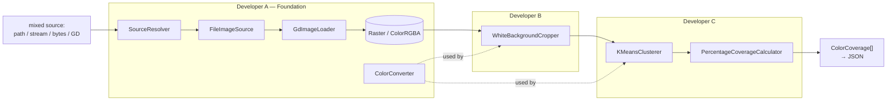
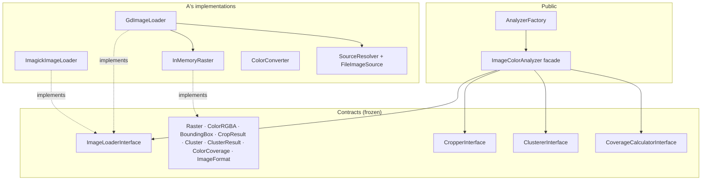
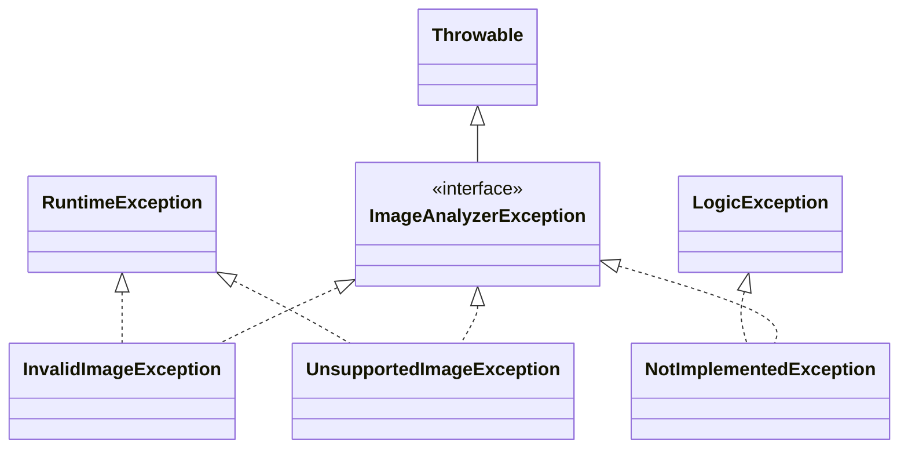
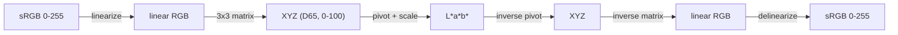
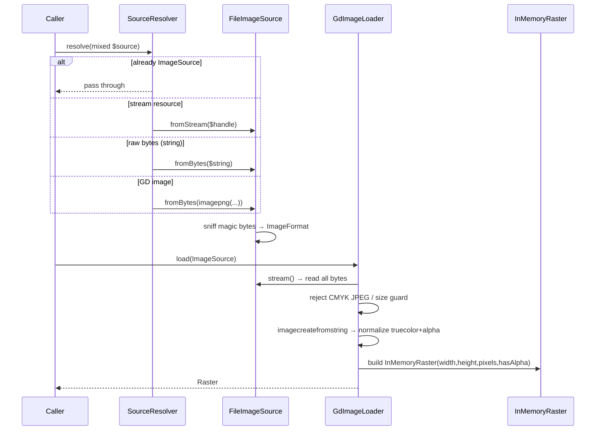
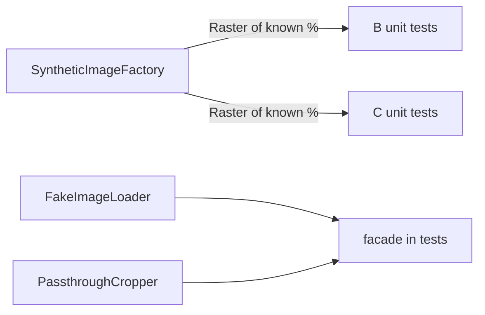
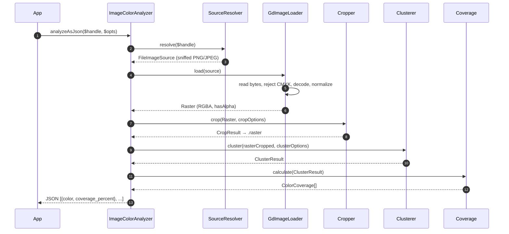
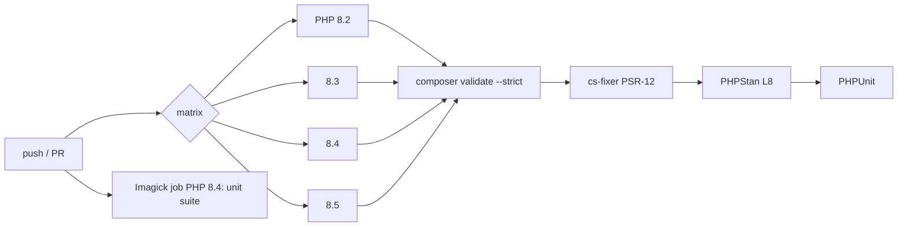

# Developer A — Module Guide
## Platform, Image I/O, and Color Foundations

> **Audience.** An experienced engineer joining the `image-color-analyzer` project who will maintain, extend, debug, or review the foundation layer.
> **Read time.** ~30–40 minutes.
> **Scope.** Everything under `src/Contracts/`, `src/Options/`, `src/Exception/`, `src/ImageLoader/`, `src/Color/`, `src/PublicAPI/` (facade skeleton), `tests/Support/`, and the project tooling (`composer.json`, CI, static analysis, CS).

---

## Table of Contents

1. [Executive Summary](#1-executive-summary)
2. [Why This Module Exists](#2-why-this-module-exists)
3. [System Overview & Position in the Pipeline](#3-system-overview--position-in-the-pipeline)
4. [Architecture](#4-architecture)
5. [Folder Structure](#5-folder-structure)
6. [The Frozen Contracts (the heart of the parallel plan)](#6-the-frozen-contracts)
7. [Options Objects](#7-options-objects)
8. [Exception Hierarchy](#8-exception-hierarchy)
9. [`InMemoryRaster` — the shared currency](#9-inmemoryraster)
10. [`ColorConverter` — the color math](#10-colorconverter)
11. [Image Loading Subsystem](#11-image-loading-subsystem)
12. [The Public Facade](#12-the-public-facade)
13. [Test Support (fakes & synthetic fixtures)](#13-test-support)
14. [Lifecycle of a Request](#14-lifecycle-of-a-request)
15. [Error Handling](#15-error-handling)
16. [Security Considerations](#16-security-considerations)
17. [Performance Considerations](#17-performance-considerations)
18. [Concurrency Considerations](#18-concurrency-considerations)
19. [Testing Strategy](#19-testing-strategy)
20. [CI/CD Interactions](#20-cicd-interactions)
21. [Known Limitations](#21-known-limitations)
22. [Future Extension Points](#22-future-extension-points)
23. [Quick Reference / Cheat Sheet](#23-quick-reference)

---

## 1. Executive Summary

Developer A owns the **platform layer**: the interfaces and immutable data objects every other module speaks through, the code that turns arbitrary input (a path, a stream, raw bytes, a GD handle) into a decoded pixel buffer, and the color-space mathematics that the cropper and clusterer depend on. If you think of the library as a factory line, Developer A built the **conveyor belt, the loading dock, and the measuring instruments** — B and C bolt their machines onto it.

Three properties define the design:

- **Interface-first.** Every seam between components is a PHP `interface` or a `readonly` DTO in `src/Contracts/`. Once these were *frozen* (end of Week 1), Developers B and C could build against stubs without ever reading A's implementation. This is what made a safe 3-way parallel split possible.
- **Driver abstraction for I/O.** GD is the default decoder, hidden behind `ImageLoaderInterface`. An Imagick adapter drops in behind the same interface with zero downstream change.
- **Purity & determinism.** No global state, no `echo`/`die`, every failure throws a typed exception. The color math is a pure function of its input.

The module is small in line count (~1,000 lines of production code) but is the **most schedule-critical work on the team**: interface churn here would have broken B and C simultaneously.

**Ownership note.** In the Git history the frozen-contract scaffold was committed by the repo lead (`e69f751`), and the production loader/color code landed via **PR #4 (`feat/loader-color-foundation`, author `velislav088`)**, merged last so it became the canonical `src/ImageLoader/` and `src/Color/`. Per `CODEOWNERS`, all of `src/Contracts`, `src/Options`, `src/Exception`, `src/ImageLoader`, `src/Color`, `tests/Support`, and `.github/` are Developer A's domain.

---

## 2. Why This Module Exists

The assignment (`Задание за стаж.txt`) asks for a library that accepts a **file handle** to a PNG/JPEG bitmap and returns the principal print colors with coverage percentages. Before any color analysis can happen, three unglamorous problems must be solved *well*:

1. **Input is polymorphic.** Callers have a path, or an already-open `fopen` handle, or bytes they just received over the wire, or a GD image they built in memory. The library must accept all of them without the downstream code caring which.
2. **Image formats are messy.** PNGs can be truecolor, palette-indexed, or grayscale, with or without an alpha channel; GD represents alpha as 0–127 (inverted); JPEGs may secretly be CMYK, which GD decodes into garbage. Downstream code must never see any of this — it must see a clean, uniform RGBA grid.
3. **"Similar color" and "near-white" are perceptual notions.** RGB distance does not match human perception. Both B (near-white detection) and C (clustering) need a color space where *Euclidean distance ≈ perceived difference*. That is CIELAB, and someone has to implement the conversion correctly.

Developer A's module solves all three behind a stable contract so B and C can assume clean inputs and correct math.

---

## 3. System Overview & Position in the Pipeline

The library is a **one-directional pipeline** of small components. Developer A provides the **entry** (loading), the **currency** (`Raster`/`ColorRGBA`), the **instruments** (`ColorConverter`), and the **orchestrator** (facade). B and C provide the two middle stages.



**Key idea:** the arrows between subsystems are all **frozen DTOs**. `GdImageLoader` hands B a `Raster`; B hands C a (cropped) `Raster`; C returns `ColorCoverage[]`. `ColorConverter` is a shared utility injected into both B and C. Nothing reaches into anything else's internals.

---

## 4. Architecture

### 4.1 Layering



### 4.2 Design principles A enforces

| Principle | How it is enforced |
|---|---|
| **Immutability** | Every DTO is `final readonly`; `Raster` exposes no setters; `crop()` returns a *new* raster. |
| **No leaked driver types** | GD `\GdImage` never crosses an interface boundary — it is consumed entirely inside `GdImageLoader` and converted to `ColorRGBA`. |
| **Typed failure** | Every thrown exception implements `ImageAnalyzerException`, so a caller can `catch (ImageAnalyzerException $e)` for the whole family. |
| **Determinism** | A's code contains no randomness and no global state; identical input → identical `Raster`. |
| **Additive-only contract change** | Any change to `src/Contracts` or `src/Options` needs an ADR + all-three sign-off (`CONTRIBUTING.md`). |

---

## 5. Folder Structure

```
src/
├── Contracts/                     # FROZEN interfaces + DTOs — the seams
│   ├── ImageSource.php            # stream() + detectedFormat()
│   ├── ImageFormat.php            # enum PNG | JPEG
│   ├── ImageLoaderInterface.php   # supports() + load(): Raster
│   ├── Raster.php                 # immutable decoded bitmap (interface)
│   ├── ColorRGBA.php              # 8-bit RGBA value object
│   ├── BoundingBox.php            # x,y,w,h rectangle
│   ├── CropperInterface.php       # (implemented by B)
│   ├── CropResult.php             # raster + boundingBox + wasCropped
│   ├── ClustererInterface.php     # (implemented by C)
│   ├── Cluster.php / ClusterResult.php
│   ├── CoverageCalculatorInterface.php   # (implemented by C)
│   └── ColorCoverage.php          # {color, rgb, coveragePercent}
├── Options/
│   ├── CropOptions.php            # B's tuning knobs (physically owned by A)
│   ├── ClusterOptions.php         # C's tuning knobs (physically owned by A)
│   └── AnalyzerOptions.php        # composes crop + cluster
├── Exception/
│   ├── ImageAnalyzerException.php # marker interface : Throwable
│   ├── InvalidImageException.php  # : RuntimeException
│   ├── UnsupportedImageException.php
│   └── NotImplementedException.php # scaffold marker (removed before v1)
├── ImageLoader/
│   ├── FileImageSource.php        # path/stream/bytes → sniffed ImageSource
│   ├── SourceResolver.php         # mixed → ImageSource
│   ├── ReadsImageSourceStreams.php# trait: read all bytes from a source
│   ├── GdImageLoader.php          # the real decoder
│   ├── ImagickImageLoader.php     # optional adapter
│   └── InMemoryRaster.php         # array-backed Raster
├── Color/
│   └── ColorConverter.php         # sRGB ↔ Lab ↔ HSV, ΔE
└── PublicAPI/
    ├── ImageColorAnalyzer.php     # facade: analyze()/analyzeAsJson()
    └── AnalyzerFactory.php        # createDefault() wiring

tests/Support/
├── SyntheticImageFactory.php      # solid / contentOnBorder / bands
└── Fakes/
    ├── FakeImageLoader.php         # returns a preset raster
    └── PassthroughCropper.php      # returns input unchanged
```

The ownership is **disjoint by directory** — this is deliberate. Three people rarely touch the same file, so merge conflicts are structurally rare.

---

## 6. The Frozen Contracts

This is Developer A's single most important deliverable. The contracts are the **seams that let three people work without stepping on each other**. They are documented authoritatively in [`docs/contracts.md`](docs/contracts.md).

### 6.1 `ImageSource` + `ImageFormat`

```php
interface ImageSource
{
    /** A readable, rewindable stream positioned at the start of the image bytes.
     *  @return resource */
    public function stream();
    public function detectedFormat(): ImageFormat;   // enum PNG | JPEG
}
```

An `ImageSource` is "bytes I can read, plus what format I sniffed them to be." The loader depends only on this — not on how the bytes arrived.

### 6.2 `Raster` — the shared currency

```php
interface Raster
{
    public function width(): int;
    public function height(): int;
    public function hasAlpha(): bool;
    public function pixelAt(int $x, int $y): ColorRGBA;
    /** @return iterable<ColorRGBA> row-major, top-left → bottom-right */
    public function pixels(): iterable;
    public function crop(BoundingBox $box): Raster;   // returns a NEW raster
}
```

`Raster` is the single most-used type in the codebase. Note two deliberate API choices:

- **`pixels()` is an `iterable`** (a generator in the concrete class), so consumers can stream every pixel without forcing a second copy into memory. B's cropper and C's histogram both iterate this once.
- **`crop()` returns a `Raster`, not `void`.** Immutability again — the original is never mutated.

### 6.3 Value objects

`ColorRGBA` (see [§9-adjacent snippet in §10](#10-colorconverter)) is an immutable 8-bit RGBA with a validating constructor, `isTransparent()`, `toHex()`, and `toRgbTriplet()`. `BoundingBox` is `{x, y, width, height}` with an `area()` helper and a constructor that rejects negative origins / non-positive dimensions.

### 6.4 Result DTOs owned by A, produced by B and C

```php
final readonly class CropResult {           // produced by B
    public function __construct(
        public Raster $raster,
        public BoundingBox $boundingBox,
        public bool $wasCropped,
    ) {}
}

final readonly class Cluster {              // produced by C
    /** @param array{0:float,1:float,2:float} $lab */
    public function __construct(
        public ColorRGBA $centroid,
        public array $lab,
        public int $weight,
    ) {}
}
```

A owns these DTOs even though B and C *construct* them, because they are part of the frozen surface. If B needed a new field on `CropResult`, that would be a contract change routed through A + an ADR.

> **Reviewer tip.** When you review a B or C PR, your first check is *contract adherence*: are they constructing these DTOs exactly as declared, and not widening any signature? That is why `CODEOWNERS` makes A a required reviewer on B's and C's PRs.

---

## 7. Options Objects

Options are `final readonly` and carry defaults inline, so a caller can override just one knob. `AnalyzerOptions` composes the two stage-specific option objects using PHP's `new` initializer:

```php
final readonly class AnalyzerOptions
{
    public function __construct(
        public CropOptions $crop = new CropOptions(),
        public ClusterOptions $cluster = new ClusterOptions(),
    ) {}
}
```

`CropOptions` (`lightnessMin=95.0`, `chromaMax=5.0`, `lineContentFraction=0.002`, `alphaThreshold=8`) and `ClusterOptions` (`fixedK=null`, `kMax=8`, `histogramBitsPerChannel=5`, `mergeDeltaE=3.0`, `minClusterCoverage=0.01`, `seed=1`, `alphaThreshold=8`) live physically in `src/Options/` (A's directory) but their *fields* are specified by B and C respectively. The facade passes each option object straight through to its stage — A never reads global config.

---

## 8. Exception Hierarchy



- **`ImageAnalyzerException`** is a *marker interface* extending `Throwable`. Every exception the library throws implements it, so consumers can catch the whole family with one block.
- **`InvalidImageException`** — the bytes are broken/unreadable (corrupt PNG, empty stream, unreadable path).
- **`UnsupportedImageException`** — the input is a valid image the GD driver can't handle faithfully (CMYK JPEG, non-PNG/JPEG format, oversized image).
- **`NotImplementedException`** — a temporary scaffold marker; its docblock says *"Every occurrence must be removed before v1.0.0."* Grepping for it is a quick "are we done?" check.

The **why**: distinguishing *invalid* from *unsupported* lets a caller react differently — retry/annotate a corrupt upload vs. route a CMYK file to Imagick.

---

## 9. `InMemoryRaster`

The one concrete `Raster` in the library. It stores a **flat, row-major `list<ColorRGBA>`** and validates its own invariants on construction:

```php
public function __construct(
    private readonly int $width,
    private readonly int $height,
    private readonly array $pixels,
    private readonly bool $hasAlpha = false,
) {
    if ($width <= 0 || $height <= 0) {
        throw new InvalidArgumentException('Raster dimensions must be positive.');
    }
    if (count($pixels) !== $width * $height) {
        throw new InvalidArgumentException(/* pixel count vs dimensions */);
    }
}
```

`pixelAt($x, $y)` bounds-checks and indexes `$pixels[$y * $width + $x]`. `pixels()` is a generator (`yield from`). `crop(BoundingBox)` copies the sub-rectangle into a new `InMemoryRaster`, preserving `hasAlpha`.

**Why array-backed and not GD-backed?** Deliberate simplicity: this class backs *both* real decoded images and synthetic test fixtures, and it must not depend on `ext-gd` (so B and C can build rasters in unit tests without touching GD). The trade-off is memory — see [§17](#17-performance-considerations).

---

## 10. `ColorConverter`

The numerical core. Pure, deterministic, side-effect-free — and on the hot path for both B and C, so it is written to be allocation-light and branch-light.

### 10.1 The conversion pipeline

Analysis happens in **CIELAB (D65)**; RGB stays the transport format. The forward path is `sRGB (0–255) → linear sRGB → XYZ (D65) → L*a*b*`.



The gamma step is the standard sRGB transfer function:

```php
private function linearize(float $channel): float
{
    return $channel > 0.04045
        ? (($channel + 0.055) / 1.055) ** 2.4
        : $channel / 12.92;
}
```

and the `L*` computation uses the CIE pivot with the `0.008856` / `7.787` constants:

```php
public function rgbToLab(ColorRGBA $c): array
{
    [$x, $y, $z] = $this->rgbToXyz($c);
    $fx = $this->pivotXyz($x / 95.047);   // D65 white point
    $fy = $this->pivotXyz($y / 100.0);
    $fz = $this->pivotXyz($z / 108.883);
    return [116.0 * $fy - 16.0, 500.0 * ($fx - $fy), 200.0 * ($fy - $fz)];
}
```

### 10.2 Distance metrics

Two ΔE functions are provided:

- **`deltaE()` — CIE76**, plain Euclidean distance in Lab. This is the workhorse: it is what "similar color" means for C's clustering and merge passes, and what "low chroma" is measured against for B.
- **`deltaE94()` — CIE94** with graphic-arts weighting (`kL=1, K1=0.045, K2=0.015`), available for callers who want a more perceptually-tuned distance.

```php
public function deltaE(array $lab1, array $lab2): float
{
    return sqrt(($lab1[0]-$lab2[0])**2 + ($lab1[1]-$lab2[1])**2 + ($lab1[2]-$lab2[2])**2);
}
```

> **Design subtlety C exploits.** Because CIE76 ΔE *is* Euclidean distance in Lab, C's `WeightedKMeans` uses the **squared** form (no `sqrt`) in its hot assignment loop and gets identical nearest-centroid decisions. A's converter gives them that freedom by keeping Lab a plain `[L,a,b]` triplet.

### 10.3 Reference-value correctness

The converter is validated against published constants (`tests/Unit/Color/ColorConverterTest.php`): white → `L*≈100, a≈0, b≈0`; black → `L*≈0`; mid-gray(128) → `L*≈53.6`; the primaries red/green/blue → their canonical Lab triplets within `0.05`; `ΔE(white,black)≈100`; HSV hue of the primaries → `0/120/240°`. Round-trip tests (`rgbToLab→labToRgb`, `rgbToHsv→hsvToRgb`) confirm inversion stays within one byte.

I re-ran these live against the current code: `Lab white L=100.00 a=0.01 b=-0.01`, `black L=0.00`, `gray128 L=53.59`, `ΔE(white,black)=100.00`. ✔

> **Note on `labToRgb` / `hsvToRgb`.** A *does* ship the inverse conversions, but C deliberately avoids needing `labToRgb` (it averages member RGB instead — see C's guide), so the inverse is currently used mainly by the converter's own round-trip tests. It exists as a ready extension point.

---

## 11. Image Loading Subsystem

This is where "polymorphic, messy input" becomes "clean RGBA grid." Three collaborators:



### 11.1 `SourceResolver` — normalizing `mixed`

The public API accepts `mixed`. `SourceResolver::resolve()` is a small type-dispatch:

```php
public function resolve(mixed $source): ImageSource
{
    if ($source instanceof ImageSource)       return $source;
    if ($source instanceof \GdImage)          return FileImageSource::fromBytes($this->encodePng($source));
    if (is_resource($source)) {
        if (get_resource_type($source) === 'gd') return FileImageSource::fromBytes($this->encodeLegacyGdResource($source));
        return FileImageSource::fromStream($source);
    }
    if (is_string($source))                   return FileImageSource::fromBytes($source);  // bytes, never a path
    throw new InvalidArgumentException(/* ... */);
}
```

Two decisions worth internalizing:

- **A plain string is treated as raw image bytes, never as a path.** Path input goes through the separate `resolvePath()` / `analyzePath()` entry point. This removes an entire class of ambiguity/security bug (a caller can't accidentally turn attacker-controlled bytes into a filesystem read).
- **GD images are re-encoded to PNG** and fed back through the normal decode path, so there's exactly one rasterization codepath to trust. The PNG encode is wrapped in output buffering with an error handler that restores buffer depth on failure.

### 11.2 `FileImageSource` — magic-byte sniffing & rewindable streams

Format is detected from the **first 8 bytes**, never the extension:

```php
private static function sniff($handle): ImageFormat
{
    rewind($handle);
    $magic = (string) fread($handle, 8);
    rewind($handle);
    if (str_starts_with($magic, "\x89PNG\x0d\x0a\x1a\x0a")) return ImageFormat::PNG;
    if (str_starts_with($magic, "\xFF\xD8\xFF"))            return ImageFormat::JPEG;
    throw new UnsupportedImageException('Only PNG and JPEG sources are supported.');
}
```

`FileImageSource` has three named constructors — `fromPath`, `fromBytes`, `fromStream` — and one crucial robustness feature: **non-seekable streams are drained into an in-memory `php://temp` buffer** so the rest of the code can rely on `stream()` always being rewindable:

```php
public static function fromStream($handle): self
{
    // ... validate it's a stream ...
    if (!self::isSeekable($handle)) {
        $bytes = stream_get_contents($handle);
        // ... 
        return self::fromBytes($bytes);   // becomes a seekable php://temp
    }
    return new self($handle, self::sniff($handle));
}
```

This matters because a network/pipe stream (`php://input`, a socket) can't be `rewind()`ed, and both sniffing *and* decoding need to read from the start.

### 11.3 `GdImageLoader` — decode + normalize

The real workhorse. `load()` orchestrates: read bytes → reject CMYK JPEG → decode → size-guard → normalize to truecolor+alpha → rasterize. The whole GD handle lifecycle is wrapped in `try/finally` so `imagedestroy()` always runs.

**Normalization** is the subtle part. Palette/grayscale images are re-drawn onto a fresh truecolor canvas that has alpha blending *off* and save-alpha *on*, so transparency is preserved verbatim:

```php
private function normalizeTruecolorWithAlpha(\GdImage $image): \GdImage
{
    if (imageistruecolor($image)) {
        imagealphablending($image, false);
        imagesavealpha($image, true);
        return $image;
    }
    // palette/grayscale → new truecolor canvas, copy pixel-by-pixel preserving alpha
    // ...
}
```

**Alpha conversion** is centralized in one place — GD stores alpha as 0–127 (0 = opaque), the library uses 0–255 (255 = opaque):

```php
$gdAlpha = ($rgba & 0x7F000000) >> 24;
return new ColorRGBA(
    ($rgba >> 16) & 0xFF, ($rgba >> 8) & 0xFF, $rgba & 0xFF,
    (int) round((127 - $gdAlpha) * 255 / 127),   // the ONE alpha formula
);
```

`hasAlpha()` on the resulting raster is set true only if some pixel actually has `a < 255`, so JPEGs correctly report `false`.

**CMYK JPEG rejection** happens *before* decoding, by inspecting `getimagesizefromstring()` channel count:

```php
if (($info['channels'] ?? 3) === 4) {
    throw new UnsupportedImageException(
        'CMYK JPEG images require the optional Imagick loader; GD cannot decode them reliably.',
    );
}
```

**Size guard.** `assertImageSizeSupported()` rejects images beyond `maxPixels` (default 64 MP), computed as `$width > intdiv($maxPixels, $height)` — an overflow-safe way to check `w*h > maxPixels`.

### 11.4 `ImagickImageLoader` — the optional adapter

Same `ImageLoaderInterface`, feature-detected at runtime (`class_exists('Imagick')`). Its strategy is pragmatic: let Imagick do the *tricky* decode (CMYK, ICC, colorspace normalization to sRGB), re-emit **PNG32 bytes**, then hand those to the trusted `GdImageLoader` path. So there is still only one rasterizer. All Imagick calls go through a reflective `invoke()` wrapper so the class references no Imagick symbols at compile time (keeps PHPStan green without the extension installed).

---

## 12. The Public Facade

`ImageColorAnalyzer` is the entry point. Its constructor takes the four components by **interface** — pure dependency injection, no knowledge of concrete classes:

```php
public function analyze(mixed $source, ?AnalyzerOptions $options = null): array
{
    $options ??= new AnalyzerOptions();
    $raster   = $this->loader->load($this->sourceResolver->resolve($source));
    $cropped  = $this->cropper->crop($raster, $options->crop)->raster;
    $clusters = $this->clusterer->cluster($cropped, $options->cluster);

    $result = [];
    foreach ($this->coverage->calculate($clusters) as $item) {
        $result[] = $item->toArray();
    }
    return $result;
}
```

Note how the facade **unwraps `CropResult->raster`** — B and C never see each other's DTOs; the facade sequences them. Convenience variants: `analyzePath()` (filesystem), `analyzeAsJson()` / `analyzePathAsJson()` (pretty JSON with `JSON_PRESERVE_ZERO_FRACTION` so `50.0` doesn't collapse to `50`).

`AnalyzerFactory::createDefault()` is the batteries-included wiring:

```php
$converter = new ColorConverter();
return new ImageColorAnalyzer(
    new GdImageLoader(),
    new WhiteBackgroundCropper($converter),
    new KMeansClusterer($converter, new ColorHistogram(), new KSelector($converter)),
    new PercentageCoverageCalculator(),
);
```

The facade is **jointly owned** (`src/PublicAPI/ → @dev-a @dev-b @dev-c`); A owns the skeleton, and final wiring was a joint Week-3 task.

---

## 13. Test Support

A's parallelization insurance. Shipped in Week 1 so B and C were **never blocked** waiting for real components.

- **`SyntheticImageFactory`** builds rasters with *exactly known* composition:
  - `solid(w, h, color)` — uniform fill.
  - `contentOnBorder(w, h, margin, content, background=white)` — a content rectangle inside a margin; B asserts exact crop boxes against this.
  - `bands(w, h, [{color, fraction}...])` — horizontal color bands with known coverage; C asserts percentages against this. The last band absorbs the rounding remainder so pixel counts are exact.
- **`FakeImageLoader`** — returns a preset `Raster` regardless of source (lets C test the full facade without GD).
- **`PassthroughCropper`** — returns its input unchanged wrapped in a `CropResult` (lets C test clustering without B's cropper).



---

## 14. Lifecycle of a Request

End-to-end, following a `fopen` handle to a JSON string (the assignment's core scenario):



I verified this exact flow live: a PNG with a red block on a white border, written to a `php://temp` handle, returns `[{ "color": "#FF0000", "coverage_percent": 100.0 }]`; a blue|red JPEG returns a clean 50/50 split; a half-transparent PNG counts only the opaque half. ✔

---

## 15. Error Handling

A's contract: **every failure path throws an `ImageAnalyzerException` subtype**; nothing returns `null`/`false` to signal an error, and nothing emits output.

| Failure | Exception | Where |
|---|---|---|
| Unreadable / missing path | `InvalidImageException` | `FileImageSource::fromPath` |
| Empty or unreadable stream | `InvalidImageException` | `ReadsImageSourceStreams::readAllBytes` |
| Non-PNG/JPEG magic bytes | `UnsupportedImageException` | `FileImageSource::sniff` |
| Corrupt image bytes | `InvalidImageException` | `GdImageLoader::createImageFromBytes` |
| CMYK JPEG | `UnsupportedImageException` | `GdImageLoader::rejectUnsupportedJpeg` |
| Image exceeds `maxPixels` | `UnsupportedImageException` | `GdImageLoader::assertImageSizeSupported` |
| Channel value out of 0–255 | `InvalidArgumentException` | `ColorRGBA` constructor |

A pattern used throughout the loader is **swallow GD's procedural warnings, then decide explicitly**:

```php
set_error_handler(static fn (): bool => true);
try {
    $image = imagecreatefromstring($bytes);
} catch (Throwable $e) {
    throw new InvalidImageException('GD could not decode the image bytes.', previous: $e);
} finally {
    restore_error_handler();
}
if (!$image instanceof \GdImage) {
    throw new InvalidImageException('GD could not decode the image bytes.');
}
```

GD reports failure as a warning + `false`, not an exception, so A installs a temporary error handler, checks the return type, and converts to a typed exception — always restoring the previous handler in `finally`.

---

## 16. Security Considerations

Image decoding is a classic attack surface. A's mitigations:

- **Decompression-bomb / memory guard.** `maxPixels` (default 64 MP) is checked *before* rasterizing, using overflow-safe integer division. A 100,000 × 100,000 "small" PNG is rejected instead of exhausting memory.
- **Format is sniffed, not trusted.** A `.png` file that is actually something else is caught by magic-byte sniffing; anything that isn't PNG/JPEG is rejected up front.
- **String input is bytes, not a path.** `SourceResolver` never interprets a caller string as a filename, so there is no path-traversal / arbitrary-file-read vector through `analyze()`. Filesystem access is confined to the explicit `analyzePath()`.
- **Small operational surface (ADR-002).** GD is the default precisely because ImageMagick has a much larger CVE history and needs `policy.xml` hardening. Imagick is opt-in and, even then, its output is funneled back through GD.
- **No output, no `exit`, no globals.** The library can't be tricked into emitting content or terminating the host process; failures are exceptions the caller controls.

**Residual risk to watch:** the security of GD's own decoders. Keep the PHP runtime patched; the size guard bounds resource use but not a hypothetical parser bug in `libpng`/`libjpeg`.

---

## 17. Performance Considerations

A's biggest performance lever — and its biggest risk — is **raster memory**.

- **`InMemoryRaster` stores one `ColorRGBA` object per pixel.** That is tens of bytes/pixel; a 24 MP photo materializes hundreds of MB. This is fine for the assignment's images and for tests, and it keeps the class dependency-free, but it is the documented ceiling. Developer A's plan (§17) calls out the mitigation path explicitly: switch storage to a **packed `int` per pixel** (`(a<<24)|(r<<16)|(g<<8)|b`) constructed into `ColorRGBA` lazily, or a **GD-backed lazy raster** — either behind the *unchanged* `Raster` interface.
- **Decode is O(W·H)** with a per-pixel `imagecolorat()`. `pixels()` is a generator so downstream scans (B, C) stream without a second copy.
- **`ColorConverter` is on the hot path** for every pixel B evaluates and every bin C projects, so it is kept branch-light and allocation-light (plain float arrays, no objects in the inner math).
- **The size guard doubles as a performance guard** — it bounds the worst case up front.

Because C reduces pixels to a bounded histogram before clustering, the *analysis* cost is resolution-independent; the memory ceiling is A's raster, not C's math.

---

## 18. Concurrency Considerations

PHP's request model is shared-nothing, and this library leans into it:

- **No shared mutable state.** Every DTO is `readonly`; `ColorConverter` and the loaders hold no mutable instance state across calls (the cropper's memo is reset per call — that's B's code). Two threads/processes analyzing different images share nothing.
- **No global RNG or config.** A touches neither `mt_srand` nor superglobals (C is likewise careful to use a *local* seeded engine).
- **GD handles are strictly local.** A `\GdImage` is created, used, and `imagedestroy()`ed within a single `load()` call inside a `try/finally`; it never escapes, so there's no cross-call aliasing.

An instance of `ImageColorAnalyzer` built by the factory is effectively immutable and **safe to reuse** across many `analyze()` calls in a long-running worker (e.g., a queue consumer).

---

## 19. Testing Strategy

A owns `tests/Unit/Contracts/`, `tests/Unit/Color/`, `tests/Unit/ImageLoader/`, and the shared `tests/Support/`.

| Suite | What it proves |
|---|---|
| `ColorRGBATest` | hex padding/upper-case, `isTransparent` threshold, out-of-range channel throws |
| `InMemoryRasterTest` | dimensions, `pixelAt`, `crop` sub-region, out-of-bounds + count-mismatch throw |
| `ColorConverterTest` | reference Lab/HSV values, ΔE(white,black)=100, Lab & HSV round-trips |
| `FileImageSourceTest` | PNG/JPEG magic-byte detection; unknown → `UnsupportedImageException`; unreadable path → `InvalidImageException` |
| `SourceResolverTest` | each input form (ImageSource/stream/bytes/GD) resolves correctly |
| `GdImageLoaderTest` | decodes truecolor PNG (alpha preserved), JPEG, **palette PNG normalized**, oversize rejected, corrupt → throw, CMYK header → throw |
| `ImagickImageLoaderTest` | adapter is skipped/feature-detected when the ext is absent |

**Fixture philosophy:** loader tests generate tiny PNG/JPEG bytes *programmatically* inside the test (`imagecreatetruecolor` → `imagepng`/`imagejpeg` to a buffer) so fixtures are deterministic and don't bloat the repo. Color tests assert against *published* reference constants, not self-generated numbers — so a bug in the converter can't "agree with itself."

---

## 20. CI/CD Interactions

A owns `.github/workflows/ci.yml`, `composer.json`, `phpstan.neon.dist`, `.php-cs-fixer.dist.php`, and `phpunit.xml.dist`.



- **Matrix:** PHP 8.2 / 8.3 / 8.4 / 8.5 with `ext-gd` + xdebug coverage. A separate **Imagick job** installs `ext-imagick` and runs the unit suite to exercise the adapter.
- **Gates, in order:** `composer validate --strict` → PSR-12 (php-cs-fixer, dry-run) → PHPStan **level 8** (over `src` *and* `tests`) → PHPUnit. Any failure blocks merge.
- **Note on the PHP floor.** The master `IMPLEMENTATION_PLAN.md` argued for a PHP **8.3** floor; the repo's `composer.json`/CI were later set to a **8.2** floor (commit `2f6e764`) with 8.2 added to the matrix. C's code is written to stay 8.2-safe (its RNG avoids `Randomizer::nextFloat()`, which is 8.3+). If you ever bump the floor back to 8.3, that simplification becomes available again.

---

## 21. Known Limitations

- **Memory model.** `InMemoryRaster` holds one object per pixel; very large images should be downscaled before analysis, or the packed-int raster (a designed-in extension) should be implemented. See [§17](#17-performance-considerations).
- **Formats.** 8-bit PNG and JPEG only. CMYK JPEG throws (use Imagick); 16-bit / ICC-aware handling is out of scope for the GD driver by design (ADR-002).
- **`labToRgb` under-exercised.** The inverse conversion is implemented and round-trip-tested but not on the main analysis path (C avoids it), so it carries less production mileage than the forward path.
- **`NotImplementedException` still present.** It is a scaffold marker slated for removal before a `v1.0.0` tag; its presence signals the release checklist isn't fully closed.

---

## 22. Future Extension Points

The interface-first design makes several extensions **zero-touch downstream**:

1. **New loader (e.g., WebP/AVIF, or a streaming large-image loader).** Implement `ImageLoaderInterface`, wire it in a factory variant. Nothing else changes.
2. **Packed-int / GD-backed `Raster`.** Implement `Raster` with cheaper storage; construct `ColorRGBA` lazily in `pixelAt()`/`pixels()`. The rest of the library is oblivious.
3. **Richer color science.** `ColorConverter` already has `deltaE94`; adding CIEDE2000 or a `labToRgb`-based centroid path is additive.
4. **Alternative source types.** Extend `SourceResolver` (e.g., a PSR-7 `StreamInterface`) — it's a single dispatch method.
5. **Facade middleware.** Because the facade composes interfaces, decorators (caching, logging, metrics) can wrap any stage without editing it.

Guardrail: anything touching `src/Contracts` or `src/Options` requires an **ADR + all-three sign-off**. Prefer additive changes.

---

## 23. Quick Reference

**Entry points**

```php
$analyzer = AnalyzerFactory::createDefault();
$analyzer->analyze($handleOrBytesOrGd, $options);   // list<array{color,coverage_percent}>
$analyzer->analyzePath('/img.png', $options);
$analyzer->analyzeAsJson($handle);                  // pretty JSON, 50.0 preserved
```

**Alpha formula (memorize it):** `a255 = round((127 - $gdAlpha) * 255 / 127)`, opaque = 255.

**Magic bytes:** PNG `\x89PNG\r\n\x1a\n`, JPEG `\xFF\xD8\xFF`.

**Exception rule:** catch `ImageAnalyzerException` for the whole family; `Invalid*` = broken bytes, `Unsupported*` = valid-but-can't-handle.

**Contract-change rule:** `src/Contracts` or `src/Options` → ADR + all three reviewers.

**Key files by concern:** decode → `GdImageLoader`; input normalization → `SourceResolver`+`FileImageSource`; color math → `ColorConverter`; the shared grid → `InMemoryRaster`; wiring → `AnalyzerFactory`.

---

*Cross-references: [`IMPLEMENTATION_PLAN.md`](IMPLEMENTATION_PLAN.md) · [`Developer_A_Plan.md`](Developer_A_Plan.md) · [`docs/contracts.md`](docs/contracts.md) · [`docs/ADR-001-color-space.md`](docs/ADR-001-color-space.md) · [`docs/ADR-002-gd-vs-imagick.md`](docs/ADR-002-gd-vs-imagick.md). Companion guides: [Developer B](Developer_B_Module_Guide.md) · [Developer C](Developer_C_Module_Guide.md).*
