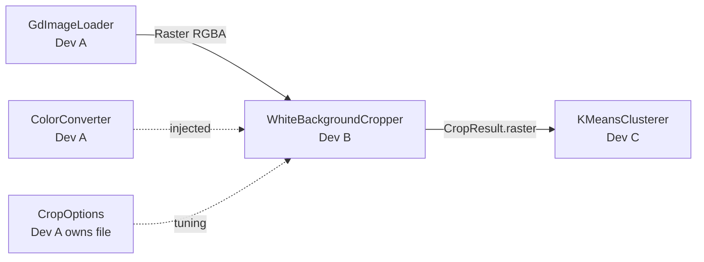
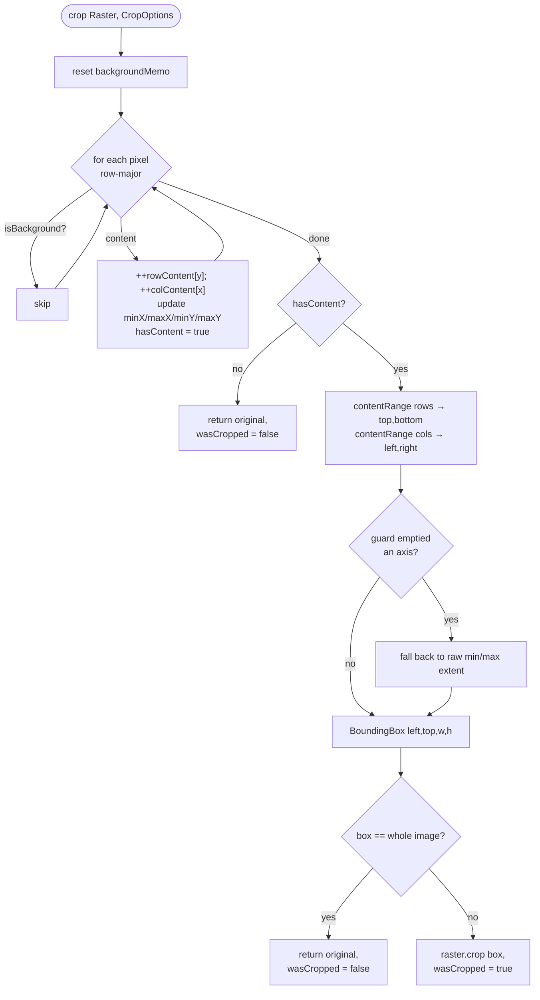
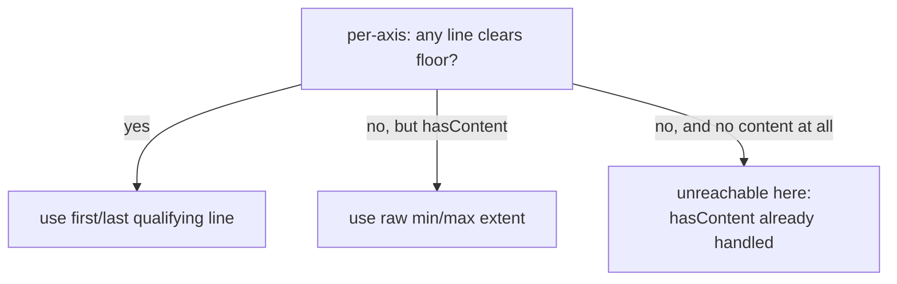
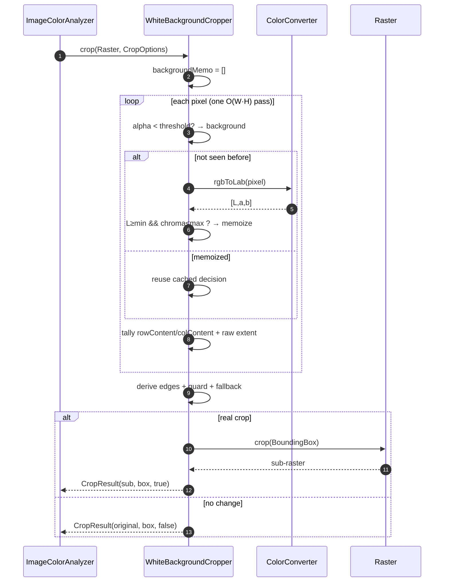

# Developer B — Module Guide
## The White Background Cropper

> **Audience.** An experienced engineer joining `image-color-analyzer` who will maintain, extend, debug, or review the cropping stage.
> **Read time.** ~25–35 minutes.
> **Scope.** `src/WhiteBackgroundCropper/WhiteBackgroundCropper.php`, its unit suite `tests/Unit/WhiteBackgroundCropper/`, the real-image integration test, and the `CropOptions` knobs the cropper is tuned by.

---

## Table of Contents

1. [Executive Summary](#1-executive-summary)
2. [Why This Module Exists](#2-why-this-module-exists)
3. [Where It Sits in the Pipeline](#3-where-it-sits-in-the-pipeline)
4. [The Core Idea: Border-Inward Scanning](#4-the-core-idea-border-inward-scanning)
5. [Architecture & Data Flow](#5-architecture--data-flow)
6. [The Near-White Predicate (`isBackground`)](#6-the-near-white-predicate)
7. [The One-Pass Scan Algorithm](#7-the-one-pass-scan-algorithm)
8. [Edge Derivation, Noise Guard & Raw-Extent Fallback](#8-edge-derivation-noise-guard--raw-extent-fallback)
9. [Assembling the `CropResult`](#9-assembling-the-cropresult)
10. [`CropOptions` — the tuning surface](#10-cropoptions)
11. [Lifecycle of a Crop Call](#11-lifecycle-of-a-crop-call)
12. [Edge Cases & How Each Is Handled](#12-edge-cases)
13. [A Notable Design Decision (dropping the RGB fast-path)](#13-a-notable-design-decision)
14. [Error Handling](#14-error-handling)
15. [Security Considerations](#15-security-considerations)
16. [Performance Considerations](#16-performance-considerations)
17. [Concurrency Considerations](#17-concurrency-considerations)
18. [Testing Strategy](#18-testing-strategy)
19. [CI/CD Interactions](#19-cicd-interactions)
20. [Known Limitations](#20-known-limitations)
21. [Future Extension Points](#21-future-extension-points)
22. [Quick Reference / Cheat Sheet](#22-quick-reference)

---

## 1. Executive Summary

Developer B owns a **single class**, `WhiteBackgroundCropper`, but it is a class that has to be *exactly right*, because a mistake here silently corrupts every downstream result. Its job: given a decoded `Raster`, find the smallest axis-aligned rectangle that still contains all the real artwork, trim away the surrounding near-white (or transparent) margin, and hand the cropped raster to the clusterer.

The design rests on one structural guarantee and three robustness features:

- **Border-inward scanning** — the module only ever moves the four edges *toward the center*. It never deletes pixels from the interior, which makes "removed legitimate white inside the artwork" **impossible by construction**, not merely unlikely.
- **Perceptual near-white detection** in CIELAB, so slightly off-white scans and JPEG halos still crop.
- **A per-line noise guard** so a few stray specks in the margin don't defeat cropping.
- **A raw-extent fallback** so genuinely tiny content (a single pixel, a hairline) is never erased by that guard.

It is a single deterministic **O(W·H)** pass, with the expensive color test memoized so a repetitive white margin costs one Lab evaluation per *unique* color.

**Ownership note.** The final implementation landed via **PR #3 (`feat/white-background-cropper`)**, authored by **Boris Savianov** (`406bbac feat(cropper): implement border-inward near-white WhiteBackgroundCropper`, plus its test suite and README tuning docs). Per `CODEOWNERS`, `src/WhiteBackgroundCropper/` is reviewed by A (contract adherence) and C (transparency consistency). An earlier iteration (PR #1) was superseded by PR #3.

---

## 2. Why This Module Exists

The assignment is explicit (§4, translated): *"remove the white background around the content… each of the four sides of the result must reach an actually-colored part, not empty white background… the background may not be perfectly white due to compression, anti-aliasing, or scanning."*

Why crop *before* clustering at all? Because coverage percentages are computed over the analyzed area. If a logo occupies 10% of a scanned page and the other 90% is white paper, then **without cropping** the clusterer would report "white ≈ 90%" and drown the actual print colors. Cropping restores the intuitive denominator: *percentages of the artwork*, not *percentages of the page*.

Two failure modes the module must avoid:

1. **Under-cropping / over-cropping** because the margin isn't pure `#FFFFFF` — scanners add a warm cast, JPEG adds ringing, anti-aliasing blends edges. A naive `== white` test fails on all three.
2. **Destroying content** — deleting a white shape that is legitimately *part of* the artwork (a white star inside a red logo), or erasing a tiny-but-real mark because it looked like noise.

The border-inward design plus the guard/fallback pair is a direct, structural answer to both.

---

## 3. Where It Sits in the Pipeline



B is **stage 2 of 4**. It consumes a `Raster` (from A's loader) and produces a `CropResult` whose `.raster` the facade forwards to C. Crucially, **B and C never call each other** — the facade (`ImageColorAnalyzer::analyze`) unwraps `CropResult->raster` and passes it on. B's only dependency is A's `ColorConverter`, injected via the constructor.

```php
public function __construct(private readonly ColorConverter $converter) {}
```

This decoupling means B can be developed, tested, and reasoned about in isolation, using A's `SyntheticImageFactory` for ground-truth inputs.

---

## 4. The Core Idea: Border-Inward Scanning

There are two ways to "remove white":

| Approach | What it does | Problem |
|---|---|---|
| **Global white removal** ❌ | Delete *every* white pixel anywhere | Punches holes in the artwork; destroys interior white; changes the pixel grid |
| **Border-inward scan** ✅ | Move each of the 4 edges inward until it hits content | Only ever trims a rectangular frame; interior is untouched |

B implements the second. Conceptually:

```
   ┌───────────────────────────┐        top ↓ stops at first content row
   │  white  white  white      │
   │  white ┌───────────┐      │   left →      ← right
   │  white │  ARTWORK  │white │        stop at first content column
   │  white │  (may have│      │
   │  white │  white in │white │        bottom ↑ stops at last content row
   │  white │  the hole)│      │
   │  white └───────────┘      │
   │  white  white  white      │
   └───────────────────────────┘
```

Because the result is always the bounding rectangle of content, **any white that lies between two content pixels is inside the box and is preserved**. This is the module's headline guarantee and it is verified by `testKeepsInteriorWhite` (a red block with a white sub-square: the box tracks the red extent, the interior white stays).

---

## 5. Architecture & Data Flow

The whole algorithm is one method, `crop()`, supported by two private helpers. Data flows in a single pass into per-line tallies, then edges are derived from those tallies.



Three pieces of per-call state:

- `rowContent[y]`, `colContent[x]` — how many **content** pixels are in each row and column (the histogram the edges are derived from).
- `minX/maxX/minY/maxY`, `hasContent` — the **raw** content extent, used only as a fallback.
- `backgroundMemo` — a packed-RGB → bool cache, reset at the top of every `crop()` call so it never leaks between images.

---

## 6. The Near-White Predicate

The single most important correctness decision is *what counts as background*. B judges it in **CIELAB**, not RGB:

```php
private function isBackground(ColorRGBA $pixel, CropOptions $options): bool
{
    if ($pixel->a < $options->alphaThreshold) {
        return true;                               // transparent → background
    }

    $key = ($pixel->r << 16) | ($pixel->g << 8) | $pixel->b;
    if (isset($this->backgroundMemo[$key])) {
        return $this->backgroundMemo[$key];        // memoized decision
    }

    [$l, $a, $b] = $this->converter->rgbToLab($pixel);
    $chroma = sqrt($a * $a + $b * $b);
    $isBackground = $l >= $options->lightnessMin && $chroma <= $options->chromaMax;

    if (count($this->backgroundMemo) < self::MEMO_CAP) {
        $this->backgroundMemo[$key] = $isBackground;
    }
    return $isBackground;
}
```

The rule, stated once:

```
background := alpha < alphaThreshold
           OR ( L* >= lightnessMin  AND  chroma = sqrt(a*² + b*²) <= chromaMax )
```

**Why Lab and not RGB?**

- **Lightness (`L*`) is perceptually uniform.** "Bright enough to be paper" is a single threshold on `L*`, which behaves the way a human eye would judge it — unlike RGB where the same numeric gap means different things in different parts of the cube.
- **Chroma captures "how colorful," independent of brightness.** A warm-white scan (say `#FFFEF8`) has high `L*` but tiny chroma → correctly background. A pale-but-real tint (a light-green fill) has enough chroma → correctly content. RGB has no clean "colorfulness" axis; HSV's is non-uniform and its hue wraps.

This is ADR-001's decision applied at the pixel level. The defaults (`lightnessMin=95.0`, `chromaMax=5.0`) mean "very light and nearly neutral."

**Transparency short-circuits before any math** — a fully/mostly transparent pixel is background regardless of its (meaningless) color channels, and it's the cheapest possible check, so it goes first.

---

## 7. The One-Pass Scan Algorithm

B iterates `Raster::pixels()` **once** (a generator, so no second copy), tracking `(x, y)` manually to avoid `W·H` calls to `pixelAt()`:

```php
$x = 0;
$y = 0;
foreach ($image->pixels() as $pixel) {
    if (!$this->isBackground($pixel, $options)) {
        ++$rowContent[$y];
        ++$colContent[$x];
        $minX = min($minX, $x);  $maxX = max($maxX, $x);
        $minY = min($minY, $y);  $maxY = max($maxY, $y);
        $hasContent = true;
    }
    if (++$x === $width) {        // manual row wrap
        $x = 0;
        ++$y;
    }
}
```

**Why count into arrays instead of four directional scans?** A single pass that accumulates `rowContent`/`colContent` is both faster (one traversal, not four) and simpler to reason about: after the loop, every edge is a pure function of these two arrays. Time is **O(W·H)**, extra memory is **O(W+H)**.

---

## 8. Edge Derivation, Noise Guard & Raw-Extent Fallback

Once the tallies exist, each edge is the first/last scan line that carries "enough" content. "Enough" is the noise guard:

```php
private function contentRange(array $lineCounts, float $minContentPixels): array
{
    $first = null; $last = null;
    foreach ($lineCounts as $index => $count) {
        if ($count > 0 && $count >= $minContentPixels) {   // clears the floor
            $first ??= $index;
            $last = $index;
        }
    }
    return [$first, $last];   // [null, null] if no line qualifies
}
```

The floor is `lineContentFraction * perpendicularDimension` — for rows it's `fraction * width`, for columns `fraction * height`. With the default `0.002` on a 600 px image, a row needs `≥ 1.2` → effectively ≥ 2 content pixels to "count." That's what lets `testIgnoresSparseNoiseInMargin` scatter single black specks across the margin and still get the exact content box back: each speck is alone on its row/column and never clears the floor.

But the guard creates a danger: what about content that is *genuinely* smaller than the floor — a one-pixel mark, a hairline? That's the **raw-extent fallback**:

```php
[$top, $bottom] = $this->contentRange($rowContent, $options->lineContentFraction * $width);
[$left, $right] = $this->contentRange($colContent, $options->lineContentFraction * $height);

if ($top === null || $bottom === null) {   // guard erased the whole vertical axis…
    $top = $minY; $bottom = $maxY;          // …but content exists → use raw extent
}
if ($left === null || $right === null) {
    $left = $minX; $right = $maxX;
}
```

The logic: *the guard is a filter for noise, not a license to delete real artwork.* If applying it would eliminate **every** qualifying line on an axis while `hasContent` is true, we know the guard over-reached, so we fall back to the exact min/max extent of content pixels. `testRawExtentFallbackRescuesContentBelowNoiseFloor` pins this with an aggressive `lineContentFraction: 0.5` — every line fails the floor, yet the single content pixel is still returned as a `1×1` box.



This guard/fallback pair is the module's most subtle logic — most cropper bugs live at exactly this boundary, so treat these two tests as load-bearing.

---

## 9. Assembling the `CropResult`

Three terminal cases, in order:

```php
// 1) Nothing but background: hand back the original untouched.
if (!$hasContent) {
    return new CropResult($image, new BoundingBox(0, 0, $width, $height), false);
}

// … derive edges (with guard + fallback) …
$box = new BoundingBox($left, $top, $right - $left + 1, $bottom - $top + 1);

$isWholeImage = $left === 0 && $top === 0 && $right === $width - 1 && $bottom === $height - 1;

// 2) Content already reaches every edge: nothing to trim.
if ($isWholeImage) {
    return new CropResult($image, $box, false);
}

// 3) A real crop: return the sub-raster.
return new CropResult($image->crop($box), $box, true);
```

Semantics worth memorizing:

- **`wasCropped = false` returns the *original* `Raster` object** (identity-equal — tests assert `assertSame`), not a copy. Callers can cheaply detect "no change."
- **The `BoundingBox` is always in original-image coordinates** — even in the no-crop cases it describes where content was found. This is useful telemetry for a caller that wants to know *where* the artwork sat.
- `width = right - left + 1` because `right`/`bottom` are **inclusive** last-content indices.

---

## 10. `CropOptions`

The tuning surface. The file lives in `src/Options/` (physically A's, per the frozen-contract rule) but its **fields are B's specification** — B drives what knobs exist; changing them is a contract change needing an ADR + A/C review.

```php
final readonly class CropOptions
{
    public function __construct(
        public float $lightnessMin = 95.0,          // min CIELAB L* to be "white"
        public float $chromaMax = 5.0,              // max CIELAB chroma to be "white"
        public float $lineContentFraction = 0.002,  // per-line noise floor
        public int   $alphaThreshold = 8,           // alpha below this = background
    ) {}
}
```

| Option | Default | Raise it to… | Lower it to… |
|---|---|---|---|
| `lightnessMin` | `95.0` | trim only very bright borders | accept dim off-white / grey paper as background |
| `chromaMax` | `5.0` | tolerate tinted / yellowed scans | trim only truly neutral white (clean exports) |
| `lineContentFraction` | `0.002` | ignore heavier speckle / dust | react to fainter content |
| `alphaThreshold` | `8` | treat more semi-transparent pixels as background | keep faint pixels as content |

**Field guidance** (from B's README subsection):

- **Clean digital exports** (pure `#FFFFFF` margin): defaults are ideal; drop `chromaMax` toward `2–3` to trim only exact white.
- **Scanned / photographed art** (off-white, warm cast, JPEG halos): raise `chromaMax` to `~8–10` and, for dim paper, lower `lightnessMin` to `~88–92`.

`testChromaToleranceControlsWhetherTintedBorderIsCropped` and `testLightnessToleranceControlsWhetherGrayBorderIsCropped` prove these knobs are *real*: a `(245,255,245)` border (chroma ≈ 6.2) is content at the default `chromaMax=5` but background at `chromaMax=7`; a `(200,200,200)` grey (`L*≈80.6`) is content by default but background at `lightnessMin=70`.

---

## 11. Lifecycle of a Crop Call



---

## 12. Edge Cases

Every one of these has a dedicated test in `WhiteBackgroundCropperTest`:

| Input | Behavior | Test |
|---|---|---|
| Symmetric white border | Exact inner box, `wasCropped=true` | `testCropsSymmetricWhiteBorder` |
| Asymmetric margins (diff. per side) | Per-edge box | `testCropsAsymmetricMargins` |
| **Interior white** inside content | Preserved — box tracks content extent | `testKeepsInteriorWhite` |
| Near-white border `(250,250,250)`, `(248,249,250)` | Still cropped (within tolerance) | `testCropsNearWhiteBorderWithinTolerance` |
| Genuine light-grey content `(200,200,200)` | **Kept** (`L*≈80.6 < 95`) | `testKeepsGenuineLightGrayContent` |
| All-white image | `wasCropped=false`, original returned | `testAllWhiteImageIsNotCropped` |
| Fully transparent image | `wasCropped=false`, original returned | `testFullyTransparentImageIsNotCropped` |
| No margin (content at every edge) | `wasCropped=false` | `testNoMarginImageIsNotCropped` |
| Single-pixel content | `1×1` box preserved | `testSinglePixelContentIsPreserved` |
| Content below noise floor | Raw-extent fallback rescues it | `testRawExtentFallbackRescuesContentBelowNoiseFloor` |
| Sparse noise specks in margin | Ignored; box = real content | `testIgnoresSparseNoiseInMargin` |
| Transparent margin (PNG alpha) | Treated as background, cropped | `testCropsTransparentMargin` |
| (property) cropped ≤ original always | Holds for all cases | `testCroppedRasterNeverExceedsOriginal` |

The mental model: **degenerate inputs (all-white, all-transparent, no-margin) return the original with `wasCropped=false`; everything else returns the tight box, with the guard/fallback pair protecting both against noise and against over-deletion.**

---

## 13. A Notable Design Decision

Developer B's plan and the master plan both *suggested* an **RGB fast-path**: before doing the Lab conversion, cheaply accept "obvious whites" where all channels are `≥ ~245`. B **intentionally omitted it**, and the reasoning is worth preserving because it's a genuine correctness-vs-speed call (documented in the PR body):

> Colors inside the "all channels ≥ 245" cube can reach **chroma ≈ 6.2**, which *exceeds* the default `chromaMax` (5.0). An RGB fast-path would classify such a pixel as white and short-circuit, but the Lab predicate would (correctly) call it **content**. The fast-path would therefore *misclassify tinted near-whites* — the exact case the module exists to get right.

Instead, B relies on **memoization** to hit the performance goal. Because margins are overwhelmingly repetitive, the packed-RGB cache means each *distinct* color pays for `rgbToLab` exactly once, no matter how many million pixels share it — delivering "pay for Lab once per color" without the correctness risk of a cheaper-but-wrong test.

This is the kind of decision a reviewer should defend: the "obvious" optimization was rejected on correctness grounds, and there's a test (`testChromaToleranceControlsWhetherTintedBorderIsCropped`, using exactly a `(245,255,245)` border) that would fail if someone re-adds a naive fast-path.

---

## 14. Error Handling

The cropper is **total** — it does not throw on any valid `Raster`. Every input, including degenerate ones, maps to a well-defined `CropResult`. The only exceptions that can surface originate *below* B:

- `InMemoryRaster::crop()` throws `InvalidArgumentException` if a box exceeds bounds — but B constructs the box from the raster's own dimensions, so this is structurally unreachable from `WhiteBackgroundCropper`. (It's a useful guard if a future `Raster` implementation miscomputes extents.)
- `BoundingBox`'s constructor rejects non-positive dimensions — also unreachable here, because B only builds a box when `hasContent` is true, guaranteeing `right ≥ left` and `bottom ≥ top`.

The design philosophy: **push validation into the DTOs (A's territory), keep the algorithm total.** B never needs a `try/catch`.

---

## 15. Security Considerations

B's attack surface is minimal because it operates purely on an already-decoded, already-validated `Raster` (A's loader handled untrusted bytes and enforced the pixel-count ceiling). Still:

- **Bounded memory.** B allocates `O(W+H)` for the tally arrays plus a background cache **capped at `MEMO_CAP = 65,536`** entries. On an adversarial many-distinct-color image the cache stops growing — colors beyond the cap are simply recomputed (still correct, just uncached), so memory stays flat. This is a deliberate DoS-resistance measure.
- **No I/O, no output, no globals.** Nothing to inject into; the class touches only its arguments and per-call state.
- **Deterministic & side-effect-free.** Same raster + options → same box, every time; no randomness to seed-attack.

The upstream pixel-count guard (A's `maxPixels`) is what protects B from an enormous `W·H` scan; B assumes that ceiling has already been enforced.

---

## 16. Performance Considerations

- **One O(W·H) pass**, never re-scanned. Everything after the loop operates on the `O(W+H)` tally arrays.
- **Memoized predicate.** The expensive step is `rgbToLab` (a handful of `pow`s). The packed-RGB `(r<<16)|(g<<8)|b` cache collapses a solid white margin — potentially millions of pixels — to *one* Lab evaluation. Margin pixels are the overwhelming majority in the target use case, so hit-rate is very high.
- **Transparency short-circuit first.** Transparent margins (PNG) skip the color math entirely.
- **Manual `(x,y)` tracking** avoids `W·H` `pixelAt()` calls (each of which bounds-checks and multiplies); iterating the generator once is strictly cheaper.
- **Memo cap trade-off.** `MEMO_CAP` bounds memory at the cost of recomputation past 65k distinct colors — the right trade because real artwork rarely exceeds that, and when it does you'd rather stay in memory budget.

**Cost model:** `time ≈ W·H` predicate lookups (mostly O(1) cache/alpha hits) `+ U` Lab conversions, where `U` is the number of *distinct* opaque colors (capped at 65k). Memory ≈ `W + H + min(U, 65536)`.

---

## 17. Concurrency Considerations

- **Per-call state is reset at entry.** `backgroundMemo` is cleared at the top of every `crop()` call, so a single `WhiteBackgroundCropper` instance can be reused across many images without cross-contamination — but note it holds that mutable array *during* a call, so **one instance must not run two `crop()` calls concurrently** (a non-issue under PHP's shared-nothing model, where each request/worker has its own instance from the factory).
- **No shared/global/static mutable state.** The only mutable field is the per-call memo; everything else is the injected, stateless `ColorConverter`.
- Safe to construct once (via `AnalyzerFactory`) and reuse serially in a long-lived worker.

---

## 18. Testing Strategy

B owns `tests/Unit/WhiteBackgroundCropper/WhiteBackgroundCropperTest.php` (the largest single test file in the repo — 326 lines) and contributed `tests/Integration/WhiteBackgroundCropperRealImageTest.php` plus real bordered fixtures.

**Core strategy: assert on the returned `BoundingBox`, not re-read pixels.** The box is deterministic and exact, so it's the strongest possible oracle:

```php
private function assertBox(int $x, int $y, int $width, int $height, BoundingBox $box): void
{
    self::assertSame([$x, $y, $width, $height], [$box->x, $box->y, $box->width, $box->height]);
}
```

A single pixel-level check (`$result->raster->pixelAt(0,0)->toHex()`) confirms the cropped raster *starts at real content*, closing the loop between "the box is right" and "the crop applied the box correctly."

**Ground truth comes from A's factory.** `SyntheticImageFactory::contentOnBorder(100,100,20,red)` produces an image whose correct answer is *known a priori* to be `(20,20,60,60)` — so the assertion is objective, not circular. For asymmetric/interior-white/noise cases, B uses a local `build(w,h,callable)` helper to paint pixels precisely.

**Coverage spans:** symmetric/asymmetric margins, interior-white preservation, near-white tolerance (data-provider over two off-white borders), genuine-grey-is-content, all-white / all-transparent / no-margin degenerates, single-pixel & below-floor fallback, noise-guard, transparent-margin, both tolerance knobs, and a universal property (`cropped ≤ original`).

**Integration layer.** `WhiteBackgroundCropperRealImageTest` runs the cropper on *actual* decoded PNG/JPEG fixtures (`logo_white_border.png`, `scan_offwhite_border.jpg`, `transparent_border.png`) to confirm it behaves on real GD output — true anti-aliasing and real alpha — not just synthetic rasters.

---

## 19. CI/CD Interactions

B's code runs under the same matrix A owns (PHP 8.2/8.3/8.4/8.5, PSR-12, PHPStan L8, PHPUnit). Two B-specific notes:

- **PHPStan baseline for a sibling.** During B's PR, C's `ColorClusterer` scaffold stubs were still red on `main` and were blocking B's CI. B added a *tightly-scoped* `phpstan.neon.dist` ignore for those pending stubs (commit `b058a57 ci(phpstan): baseline pending ColorClusterer scaffold stubs`) with a note to remove it once C's component lands. This is a good example of unblocking your own PR without weakening analysis on your own code.
- **Determinism = no flaky tests.** Because the cropper has no randomness, its exact-box assertions are stable across the whole matrix; there are no tolerance windows to tune per PHP version.

---

## 20. Known Limitations

- **White-on-white ambiguity.** If the artwork's *outer edge* is itself near-white within tolerance, it will be trimmed — there is no way to distinguish "white margin" from "white content touching the margin" without semantic understanding. This is inherent; the mitigation is the exposed tolerance (lower `chromaMax`/`lightnessMin` to be stricter) and it's documented behavior.
- **Rectangular crop only.** The output is always an axis-aligned bounding box. Content shaped like an "L" keeps the white in the notch (correctly — it's interior), but the box is still the full bounding rectangle. There's no polygonal/tight-mask crop.
- **Global thresholds.** `lightnessMin`/`chromaMax` are image-wide constants. A scan with *uneven* lighting (bright top, dim bottom) can't be handled with a single lightness floor; you'd need adaptive/local thresholds (see extensions).
- **Memo cap recomputation.** Past 65,536 distinct colors the predicate is recomputed rather than cached — a negligible slowdown on pathological inputs, but worth knowing when profiling.

---

## 21. Future Extension Points

Because B is a single class behind `CropperInterface`, alternatives slot in with zero downstream change:

1. **Adaptive thresholding.** Estimate the margin's actual color/lightness from the outermost ring of pixels and set thresholds relative to it — robust to uneven scan lighting. Would likely add a `CropOptions` field (ADR).
2. **Downscaled crop pass.** For very large images, run the border-inward scan on a downscaled copy to find the box, then apply it to the full-res raster — the box is scale-proportional. Coverage is unaffected.
3. **Tolerance auto-tuning.** Sweep `chromaMax`/`lightnessMin` and pick the setting whose resulting box is stable (a "knee" in box size vs. tolerance).
4. **Content-mask output.** Return the actual content mask alongside the box for callers that want a tight (non-rectangular) crop.
5. **Alternative `CropperInterface` implementations** entirely (e.g., an edge-detection or connected-components cropper) — wire via a factory variant.

Guardrail: adding a `CropOptions` field is a **frozen-contract change** → ADR + A/C sign-off. The algorithm itself is free to evolve as long as the interface and DTO shapes hold.

---

## 22. Quick Reference

**Entry point**

```php
$cropper = new WhiteBackgroundCropper($colorConverter);
$result  = $cropper->crop($raster, new CropOptions(/* tune here */));
$tight   = $result->raster;        // cropped (or original if !wasCropped)
$box     = $result->boundingBox;   // always in ORIGINAL coordinates
$didCrop = $result->wasCropped;    // false ⇒ .raster is the SAME object as input
```

**Background rule:** `alpha < alphaThreshold` **OR** (`L* ≥ lightnessMin` **AND** `chroma ≤ chromaMax`).

**Guarantees:** never removes interior white · never erases genuine small content · single O(W·H) pass · deterministic.

**Tuning cheats:** clean export → lower `chromaMax` (2–3). Scan → raise `chromaMax` (8–10), lower `lightnessMin` (88–92). Dusty margin → raise `lineContentFraction`.

**Two load-bearing tests:** `testKeepsInteriorWhite` (the structural guarantee) and `testRawExtentFallbackRescuesContentBelowNoiseFloor` (the guard/fallback boundary). Break the algorithm and one of these goes red first.

**Do NOT** re-introduce an "all channels ≥ 245" RGB fast-path — it misclassifies tinted near-whites (chroma can hit ~6.2 > default 5). Memoization already gives you the speed. See [§13](#13-a-notable-design-decision).

---

*Cross-references: [`IMPLEMENTATION_PLAN.md`](IMPLEMENTATION_PLAN.md) · [`Developer_B_Plan.md`](Developer_B_Plan.md) · [`docs/ADR-001-color-space.md`](docs/ADR-001-color-space.md) · [`docs/contracts.md`](docs/contracts.md). Companion guides: [Developer A](Developer_A_Module_Guide.md) · [Developer C](Developer_C_Module_Guide.md).*
