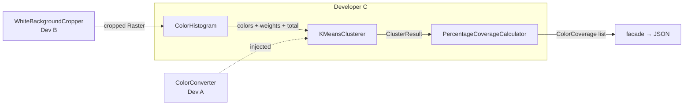
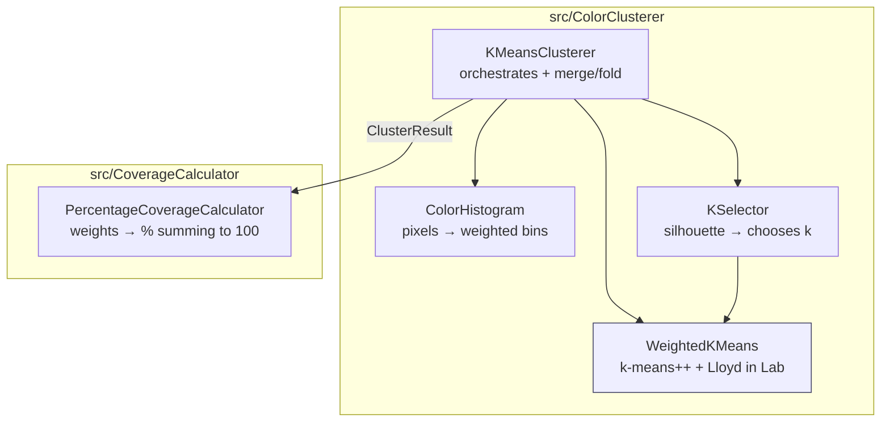
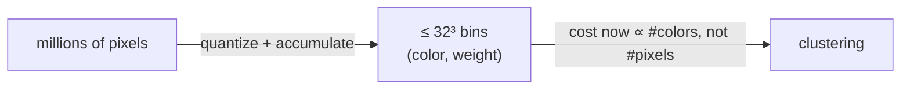
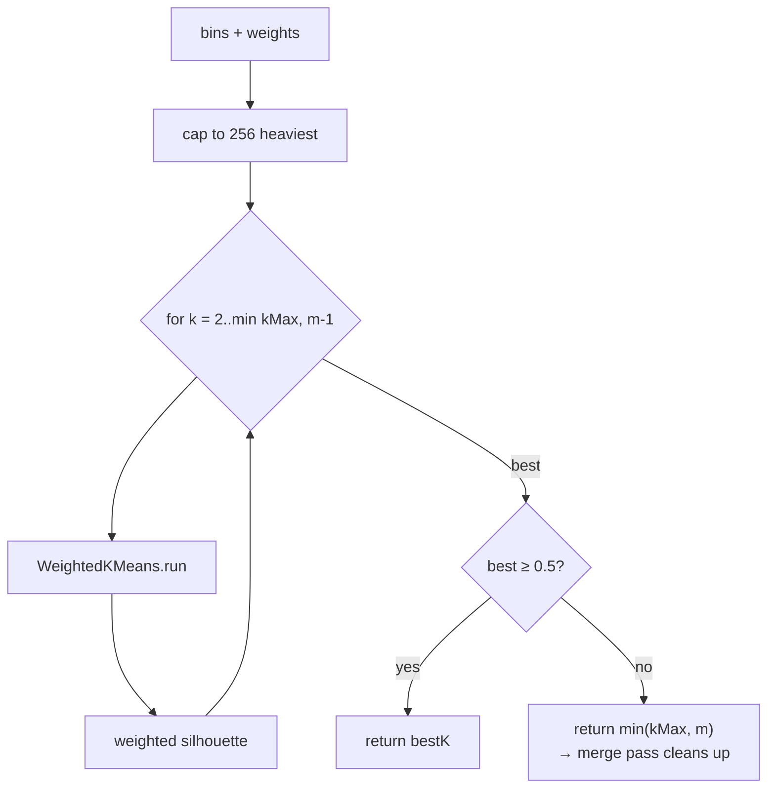
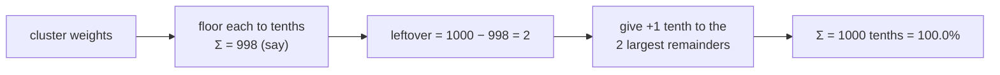
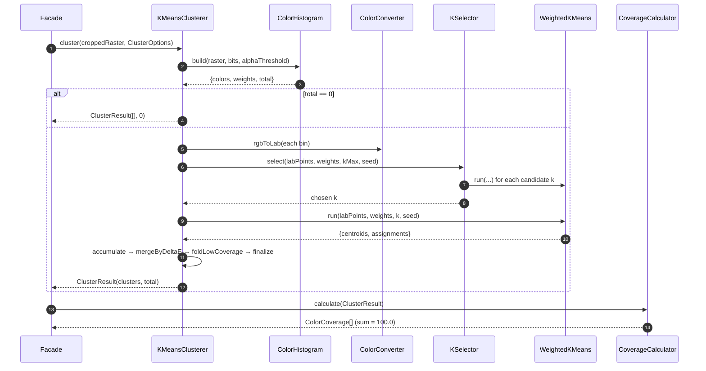

# Developer C — Module Guide
## Color Clustering, Coverage, Results, Examples & Docs

> **Audience.** An experienced engineer joining `image-color-analyzer` who will maintain, extend, debug, or review the clustering and coverage stages — the code that produces the library's actual answer.
> **Read time.** ~35–40 minutes.
> **Scope.** `src/ColorClusterer/` (`ColorHistogram`, `WeightedKMeans`, `KSelector`, `KMeansClusterer`), `src/CoverageCalculator/` (`PercentageCoverageCalculator`), the `examples/`, `docs/ADR-003-clustering.md`, the assembled `README.md`, and the end-to-end integration test.

---

## Table of Contents

1. [Executive Summary](#1-executive-summary)
2. [Why This Module Exists](#2-why-this-module-exists)
3. [Where It Sits in the Pipeline](#3-where-it-sits-in-the-pipeline)
4. [Architecture Overview](#4-architecture-overview)
5. [Folder Structure & Class Responsibilities](#5-folder-structure--class-responsibilities)
6. [Stage 1 — `ColorHistogram` (bin first, cluster second)](#6-stage-1--colorhistogram)
7. [Stage 2 — `WeightedKMeans` (k-means++ in Lab)](#7-stage-2--weightedkmeans)
8. [Stage 3 — `KSelector` (automatic k via silhouette)](#8-stage-3--kselector)
9. [Stage 4 — `KMeansClusterer` (orchestration + merge/fold)](#9-stage-4--kmeansclusterer)
10. [Stage 5 — `PercentageCoverageCalculator` (largest-remainder)](#10-stage-5--percentagecoveragecalculator)
11. [Lifecycle of a Clustering Request](#11-lifecycle-of-a-clustering-request)
12. [Determinism — the cross-cutting guarantee](#12-determinism)
13. [Error Handling & Degenerate Inputs](#13-error-handling--degenerate-inputs)
14. [Security Considerations](#14-security-considerations)
15. [Performance Considerations](#15-performance-considerations)
16. [Concurrency Considerations](#16-concurrency-considerations)
17. [Testing Strategy](#17-testing-strategy)
18. [CI/CD Interactions](#18-cicd-interactions)
19. [Examples & Documentation Ownership](#19-examples--documentation-ownership)
20. [Known Limitations](#20-known-limitations)
21. [Future Extension Points](#21-future-extension-points)
22. [Quick Reference / Cheat Sheet](#22-quick-reference)

---

## 1. Executive Summary

Developer C owns the **last two pipeline stages — the ones that produce the answer**. Everything upstream exists to feed C a clean, cropped `Raster`; everything the caller sees comes out of C. The mission: turn potentially millions of pixels into a *handful of representative print colors*, each with an accurate coverage percentage that sums to exactly `100.0`.

The design is built on one dominating idea and several supporting guarantees:

- **Bin first, cluster second.** Never run k-means on raw pixels. Reduce them to a **weighted color histogram** first, so clustering cost depends on *color diversity, not image resolution*. This single decision delivers resolution independence and smooths compression/anti-aliasing noise. It is the most important performance lever in the whole library.
- **Cluster in CIELAB with k-means++**, so "similar color" means *perceptually* similar and seeding is well-separated and reproducible.
- **Automatic k** via a weighted silhouette, with a principled fallback for "these are just N distinct colors."
- **A merge/fold pass** so anti-aliasing halos and JPEG fringes never surface as "principal" colors.
- **Exact percentages** via the largest-remainder method — the displayed values sum to `100.0`, not `99.9`.
- **Determinism** from a *local, seeded* RNG (never global state) plus deterministic tie-breaks.

I verified the whole chain live: a synthetic 50/30/20 red/blue/green image yields exactly `#FF0000 50.0% / #0000FF 30.0% / #00FF00 20.0%`, summing to `100.0000`, identical across repeated runs. ✔

**Ownership note.** C's scope landed via **PR #2 (`feat/color-clustering-coverage`)**: `a80d42b feat(clusterer): weighted-histogram k-means++ with automatic k`, `7dbe9f4 feat(coverage): largest-remainder percentage calculator`, `444b8ea test(integration)…`, `d0bc86a docs: assemble README and expand ADR-003`. Per `CODEOWNERS`, `src/ColorClusterer/`, `src/CoverageCalculator/`, `examples/`, and `README.md` are Developer C's, reviewed by A and B. The design rationale is captured in [`docs/ADR-003-clustering.md`](docs/ADR-003-clustering.md).

---

## 2. Why This Module Exists

The assignment (§5, translated): *"cluster so that close colors are grouped… the goal is NOT to count every individual pixel as a unique color, but to find the main real colors… ignore transparent pixels… compute each cluster's coverage percentage… return a list of colors with their area percentage."*

A photograph or scan has thousands of distinct RGB values even when it "looks like" three colors — JPEG blocking, anti-aliasing at edges, and scanner noise all manufacture near-duplicates. A print operator doesn't care that there are 4,000 shades of almost-red; they care that the artwork is *~42% red, ~31% blue*. C's job is to collapse that noise into the handful of colors a human would name, and to quantify each one honestly.

Three hard requirements shape every decision:

1. **Resolution independence** — a 500 px thumbnail and a 20 MP scan of the same art must give comparable answers in comparable time. (Solved by histogram binning.)
2. **Determinism** — tests must be able to assert on the output, so "random" k-means is unacceptable as-is. (Solved by a seeded local RNG + tie-breaks.)
3. **Percentages that actually sum to 100** — a downstream system consumes this; `99.9%` is a bug. (Solved by largest-remainder rounding.)

---

## 3. Where It Sits in the Pipeline



C is **stages 3 and 4 of 4**. It consumes the cropped `Raster` the facade forwards from B (C never calls B directly — see the facade in A's guide), and returns `ColorCoverage[]`. Its only external dependency is A's `ColorConverter` (`rgbToLab`, `deltaE`), injected into `KMeansClusterer` and `KSelector`.

---

## 4. Architecture Overview

C is deliberately split into **five single-responsibility classes** rather than one god-class. `WeightedKMeans` is the shared engine used by *both* `KSelector` (to score candidate k) and `KMeansClusterer` (for the final run), so the two can never disagree about what a clustering *is*.



**Dependency reading:** `KMeansClusterer` composes `ColorHistogram`, `KSelector`, and `WeightedKMeans`; `KSelector` composes `WeightedKMeans`; `PercentageCoverageCalculator` is standalone (pure arithmetic on a `ClusterResult`). All are constructor-injected and default-constructible, so the factory wiring is trivial.

---

## 5. Folder Structure & Class Responsibilities

```
src/ColorClusterer/
├── ColorHistogram.php     # Raster → { colors[], weights[], total }  (weighted binning, skips transparent)
├── WeightedKMeans.php     # deterministic weighted k-means++ / Lloyd in Lab; also wcss()
├── KSelector.php          # picks k via weighted silhouette (+ structure-threshold fallback)
└── KMeansClusterer.php    # implements ClustererInterface: histogram→Lab→k→kmeans→merge→fold→ClusterResult
src/CoverageCalculator/
└── PercentageCoverageCalculator.php  # implements CoverageCalculatorInterface: largest-remainder → 100.0
examples/
├── analyze_from_path.php   # analyzePathAsJson()
└── analyze_from_handle.php # analyzeAsJson(fopen(...))  ← the assignment's core requirement
docs/ADR-003-clustering.md  # the algorithm decision record
README.md                   # assembled: install, usage, options, output, limitations
tests/Unit/ColorClusterer/         tests/Unit/CoverageCalculator/         tests/Integration/EndToEndTest.php
```

| Class | One-line responsibility | Key public method |
|---|---|---|
| `ColorHistogram` | Reduce pixels to weighted, transparency-free bins | `build(Raster, bits, alphaThreshold): array` |
| `WeightedKMeans` | Deterministic weighted k-means++ in Lab | `run(points, weights, k, seed): {centroids, assignments}` |
| `KSelector` | Choose k by weighted silhouette | `select(labPoints, weights, kMax, seed): int` |
| `KMeansClusterer` | Orchestrate the full clustering incl. merge/fold | `cluster(Raster, ClusterOptions): ClusterResult` |
| `PercentageCoverageCalculator` | Weights → percentages summing to 100.0 | `calculate(ClusterResult): ColorCoverage[]` |

---

## 6. Stage 1 — `ColorHistogram`

**The single most important performance decision in the library** (ADR-003 §1). Instead of feeding k-means `W·H` pixels, `build()` reduces them to a set of weighted bins.

### 6.1 How binning works

Each channel is quantized to `bitsPerChannel` bits (default 5 → 32 levels/channel → ≤ 32³ = 32,768 bins). Pixels landing in the same bin are accumulated, and the bin's **representative color is the weighted average of its members**, not the bin center:

```php
$bits = max(1, min(8, $bitsPerChannel));
$shift = 8 - $bits;

foreach ($image->pixels() as $pixel) {
    if ($pixel->isTransparent($alphaThreshold)) {
        continue;                                  // transparent pixels never counted
    }
    $key = (($pixel->r >> $shift) << ($bits * 2))
         | (($pixel->g >> $shift) << $bits)
         |  ($pixel->b >> $shift);                 // packed quantized key

    if (isset($bins[$key])) {
        $bins[$key]['r'] += $pixel->r;  /* g, b similarly */  $bins[$key]['count']++;
    } else {
        $bins[$key] = ['r' => $pixel->r, 'g' => $pixel->g, 'b' => $pixel->b, 'count' => 1];
    }
    $total++;
}
ksort($bins);   // canonical order → downstream determinism independent of pixel traversal

// representative color = round(sum / count) per channel
```

### 6.2 Two subtle decisions

- **Weighted-average representative, not bin center.** If you used the bin's geometric center, every centroid would be pulled toward quantization boundaries — a systematic bias. Averaging the actual member colors removes it. `ColorHistogramTest` asserts the representative equals the true average of contributing pixels.
- **`ksort($bins)` for canonical order.** Bins are keyed by packed quantized color and sorted, so the histogram is byte-identical regardless of the order pixels were visited. This is a *prerequisite* for the whole pipeline's determinism — k-means++ sampling depends on point order.

### 6.3 Output contract

```php
return ['colors' => $colors, 'weights' => $weights, 'total' => $total];
// colors: list<[r,g,b]> representative RGB per bin
// weights: list<int>    pixel count per bin (same index)
// total:   int          analyzed (non-transparent) pixels; total === array_sum(weights)
```

`total` is the **denominator for coverage** — and because transparent pixels were `continue`d, they're excluded from *both* numerator and denominator, exactly as the assignment requires.



---

## 7. Stage 2 — `WeightedKMeans`

The deterministic clustering engine, operating on **Lab points weighted by pixel count**. Shared by `KSelector` and `KMeansClusterer` so the two never disagree.

### 7.1 Distances: squared-Euclidean in Lab

```php
private function distanceSq(array $a, array $b): float
{
    return ($a[0]-$b[0])**2 + ($a[1]-$b[1])**2 + ($a[2]-$b[2])**2;
}
```

Because CIE76 ΔE *is* Euclidean distance in Lab, the **squared** form gives identical nearest-centroid decisions while skipping a `sqrt` in the hot loop. (The merge pass, which compares against a ΔE *threshold*, uses the real `deltaE` — see §9.)

### 7.2 k-means++ seeding

Good initial centroids matter — bad seeds give bad local optima. k-means++ spreads seeds out:

```php
// First centroid: weighted-random by pixel count.
$chosen[] = $this->sampleByCumulativeInt($weights, $randomizer->getInt(0, max(0, $totalWeight - 1)));

while (count($chosen) < $k) {
    // D²: min squared Lab distance to any chosen centroid, weighted by pixel count.
    foreach ($points as $i => $point) {
        $min = INF;
        foreach ($chosen as $c) { $min = min($min, $this->distanceSq($point, $points[$c])); }
        $weightedD2[$i] = $weights[$i] * $min;  $sum += $weightedD2[$i];
    }
    if ($sum <= 0.0) {                       // remaining points coincide with centroids
        $next = $this->firstUnusedIndex($n, $chosen);   // deterministic fill
        if ($next === null) break;  $chosen[] = $next;  continue;
    }
    $target = $this->nextUnitFloat($randomizer) * $sum;
    $chosen[] = $this->sampleByCumulativeFloat($weightedD2, $target);
}
```

The next centroid is chosen with probability ∝ `weight · D²` — far-away, heavily-weighted colors are the likeliest new seeds, which is exactly what you want for "well-separated representative colors."

### 7.3 Lloyd iterations

Standard assign/recompute loop, capped at `MAX_ITERATIONS = 100` (a safety net; it almost always converges far sooner):

```php
for ($iteration = 0; $iteration < $maxIterations; $iteration++) {
    $changed = false;
    foreach ($points as $i => $point) {
        // nearest centroid; ties break to the LOWEST index (deterministic)
        $best = 0; $bestDistance = $this->distanceSq($point, $centroids[0]);
        for ($c = 1; $c < $k; $c++) {
            $distance = $this->distanceSq($point, $centroids[$c]);
            if ($distance < $bestDistance) { $bestDistance = $distance; $best = $c; }
        }
        if ($assignments[$i] !== $best) { $assignments[$i] = $best; $changed = true; }
    }
    if (!$changed && $iteration > 0) break;                 // converged
    $centroids = $this->recomputeCentroids($points, $weights, $assignments, $centroids);
}
```

Two determinism details baked in: the `<` (strict) comparison means **ties always keep the lower centroid index**, and `recomputeCentroids` reuses the *previous* centroid for any cluster that went empty (`sumW === 0`) instead of leaving a hole.

`wcss()` (weighted within-cluster sum of squares — the elbow diagnostic) is also exposed here for callers who want it.

---

## 8. Stage 3 — `KSelector`

Chooses **how many** clusters. Primary criterion: a **weighted silhouette** over the bins for `k = 2..min(kMax, m-1)`; higher is better-separated.

### 8.1 The silhouette, weighted and singleton-safe

For each point, silhouette compares the mean distance to its own cluster (`a`) against the mean distance to the nearest *other* cluster (`b`): `s = (b - a) / max(a, b)`. C weights every distance by pixel count and handles the classic degenerate carefully:

```php
// A point alone in its cluster contributes 0 by convention.
if ($countInCluster[$own] <= 1) {
    continue;
}
```

**Why this matters:** without the singleton convention, putting every point in its own cluster (`k = n`) would score a perfect silhouette of 1 and always "win" — a well-known silhouette trap. Scoring a lone point as `0` (not `1`) blocks that. This is also why the search only goes up to `m - 1`: the all-singleton clustering `k = m` can never be scored, so it can't be spuriously selected.

### 8.2 The structure-threshold fallback

What if *no* k shows real structure — e.g., the image is 5 mutually distinct print colors with no sub-grouping? Silhouette will be weak for every k. C handles this explicitly:

```php
if ($bestK > 0 && $bestScore >= self::STRUCTURE_THRESHOLD) {   // 0.5
    return $bestK;
}
return max(1, min($kMax, $m));   // treat each heavy bin as its own color; merge pass folds the rest
```

`STRUCTURE_THRESHOLD = 0.5` is the conventional "reasonable structure" cutoff (>0.7 strong, 0.5–0.7 reasonable, <0.5 weak). Below it, the bins have no genuine sub-structure, so C returns `min(kMax, m)` and lets the **merge pass** (§9) fold anything actually close. *This is what makes a clean N-pure-color image resolve to exactly N clusters* — verified by `testGroupsThreeDistinctColors` (→ 3) and the fixed-k / auto-k tests.

### 8.3 Cost cap

Silhouette is **O(bins²)** per k. To keep k-selection cheap, only the `SILHOUETTE_MAX_POINTS = 256` heaviest bins are scored (the rest carry negligible coverage). Critically, **the final clustering in `KMeansClusterer` still uses every bin** — the cap only bounds the *k-selection* cost, not the result quality.



---

## 9. Stage 4 — `KMeansClusterer`

The orchestrator implementing `ClustererInterface`. It sequences the whole clustering and applies the two cleanup passes.

### 9.1 The `cluster()` pipeline

```php
public function cluster(Raster $image, ClusterOptions $options): ClusterResult
{
    $histogram = $this->histogram->build($image, $options->histogramBitsPerChannel, $options->alphaThreshold);
    $total = $histogram['total'];
    if ($total === 0) {
        return new ClusterResult([], 0);                       // fully transparent → empty
    }

    $rgbPoints = $histogram['colors'];
    $weights   = $histogram['weights'];
    $labPoints = array_map(fn($c) => $this->converter->rgbToLab(new ColorRGBA(...$c)), $rgbPoints);

    $k = $this->resolveK($labPoints, $weights, $options);      // fixedK or KSelector
    $result = $this->kmeans->run($labPoints, $weights, $k, $options->seed);

    $clusters = $this->accumulate($rgbPoints, $labPoints, $weights, $result['assignments'], count($result['centroids']));
    $clusters = $this->mergeByDeltaE($clusters, $options->mergeDeltaE);         // pass 1
    $clusters = $this->foldLowCoverage($clusters, $total, $options->minClusterCoverage);  // pass 2

    return new ClusterResult($this->finalize($clusters), $total);
}
```

`resolveK` honors `fixedK` when set (clamped to `[1, uniqueBins]`), short-circuits `uniqueBins ≤ 2` to that count, and otherwise defers to `KSelector`.

### 9.2 The "summed working cluster" representation

A neat trick makes the merge/fold passes cheap. Each working cluster stores **summed weighted channels** (RGB *and* Lab) plus total weight:

```
array{ sumR, sumG, sumB, sumL, sumA, sumBLab, weight }
```

Merging two clusters is then just **adding their sums** (`combine()`), and a cluster's current Lab centroid is `sum/weight` on demand (`labOf()`). No re-scanning of member pixels is ever needed.

### 9.3 Pass 1 — merge by ΔE

```php
private function mergeByDeltaE(array $clusters, float $threshold): array
{
    while (count($clusters) > 1) {
        // find the globally closest pair (ties → lowest index)
        // ... compute deltaE(labOf(i), labOf(j)) over all pairs ...
        if ($closest >= $threshold || $mergeA < 0) break;
        $clusters[$mergeA] = $this->combine($clusters[$mergeA], $clusters[$mergeB]);
        array_splice($clusters, $mergeB, 1);
    }
    return $clusters;
}
```

Repeatedly collapses the closest pair while they're within `mergeDeltaE` (default 3.0 — near the threshold of human-perceptible difference). This is what stops an anti-aliased edge (which bins into "red" *and* "slightly-darker-red") from reporting as two principal colors.

### 9.4 Pass 2 — fold low coverage

```php
private function foldLowCoverage(array $clusters, int $total, float $minCoverage): array
{
    $floor = $minCoverage * $total;
    while (count($clusters) > 1) {
        // find the smallest-weight cluster
        if ($clusters[$smallest]['weight'] >= $floor) break;      // all clear the floor
        $target = $this->nearestOther($clusters, $smallest);      // nearest by ΔE
        $clusters[$target] = $this->combine($clusters[$target], $clusters[$smallest]);
        array_splice($clusters, $smallest, 1);
    }
    return $clusters;
}
```

Folds any cluster below `minClusterCoverage` (default 0.01 = 1%) into its nearest neighbor, smallest first, until everyone clears the floor or one cluster remains. This removes JPEG fringe colors and sub-1% speckle. `testFoldsLowCoverageSpeckleIntoNeighbor` proves it: 9,990 red + 10 blue pixels → the blue (0.1%) folds away, one cluster of weight 10,000.

### 9.5 Output color without a Lab inverse

Each final cluster's output RGB is the **weight-weighted average of member bins' representative RGB**, clamped to `[0,255]`:

```php
$centroid = new ColorRGBA(
    $this->clamp((int) round($cluster['sumR'] / $w)),
    $this->clamp((int) round($cluster['sumG'] / $w)),
    $this->clamp((int) round($cluster['sumB'] / $w)),
);
```

**Why average RGB instead of inverting the Lab centroid?** Averaging member RGB is guaranteed **in-gamut** (it's a convex combination of real colors), cheap, and avoids needing a `labToRgb` from A — which would have been a frozen-contract dependency. (A *does* ship `labToRgb`, but C deliberately doesn't depend on it; ADR-003 §6.) `finalize()` then sorts clusters by weight descending, ties broken by hex ascending, for stable output.

---

## 10. Stage 5 — `PercentageCoverageCalculator`

Turns cluster weights into percentages that **sum to exactly 100.0**. The naive approach — round each `weight/total·100` independently — routinely produces `99.9` or `100.1`. C uses the **largest-remainder method** in integer tenths.

### 10.1 The algorithm

```php
private const TENTHS_TOTAL = 1000;   // 100.0% expressed as 1000 tenths

// 1) Floor every share to an integer number of tenths; track the fractional remainder.
foreach ($result->clusters as $i => $cluster) {
    $exact = $cluster->weight / $total * self::TENTHS_TOTAL;
    $tenths[$i]     = (int) floor($exact);
    $remainders[$i] = $exact - $tenths[$i];
    $allocated     += $tenths[$i];
}
// 2) Hand the leftover tenths (always < cluster count) to the largest remainders.
$this->distributeRemainder($tenths, $remainders, self::TENTHS_TOTAL - $allocated, $result);
```

Working in **integer tenths** means the arithmetic is exact — no float drift — and the leftover (`1000 - Σfloors`) is a small non-negative integer distributed one tenth at a time to the clusters that were "robbed" most by flooring.

### 10.2 Deterministic tie-breaking

When remainders tie, the order is fixed so output is stable:

```php
// sort by: remainder desc, then weight desc, then hex asc
$byRemainder = $remainders[$b] <=> $remainders[$a];
if ($byRemainder !== 0) return $byRemainder;
$byWeight = $result->clusters[$b]->weight <=> $result->clusters[$a]->weight;
if ($byWeight !== 0) return $byWeight;
return strcmp($result->clusters[$a]->centroid->toHex(), $result->clusters[$b]->centroid->toHex());
```

Final results are sorted by coverage descending (ties → hex ascending) and mapped to `ColorCoverage(hex, rgb, percent)`. **`total === 0` or no clusters → `[]`** (a fully transparent image yields an empty list, per the assignment).



`PercentageCoverageCalculatorTest` (153 lines) asserts the sum is *exactly* `100.0` across many weight sets, plus ordering and tie-break behavior.

---

## 11. Lifecycle of a Clustering Request



---

## 12. Determinism

Determinism is a **first-class, tested property** — `testIsDeterministicForFixedSeed` asserts two runs produce identical serialized clusters. It's achieved by controlling *every* source of nondeterminism:

- **Local, seeded RNG — never global.** `WeightedKMeans` uses `new Randomizer(new Mt19937($seed))`, not `mt_srand`/`mt_rand`. So clustering is a pure function of `(points, weights, k, seed)` with **zero global side effects** — two analyses in the same process can't perturb each other's randomness. (ADR-003 §7.)
- **Canonical input order.** `ColorHistogram` `ksort`s its bins, so point order into k-means++ is fixed regardless of pixel traversal.
- **Deterministic tie-breaks everywhere.** Nearest-centroid ties → lowest index; merge order → lowest-index closest pair; remainder distribution → remainder/weight/hex; final sort → weight desc then hex asc.
- **8.2-safe float sampling.** `nextUnitFloat()` uses `getInt(0, PHP_INT_MAX)/PHP_INT_MAX` instead of `Randomizer::nextFloat()` (which is 8.3+), keeping the whole module deterministic *and* runnable on the project's 8.2 floor.

> **Debugging tip.** If output ever becomes non-reproducible, suspect (in order): a new code path touching global RNG, a change that skips the `ksort`, or a `<=`/`<` flip in a tie-break. Those are the only ways to break determinism here.

---

## 13. Error Handling & Degenerate Inputs

C's stages are **total** on any valid `Raster`/`ClusterResult` — they don't throw; they handle degeneracies explicitly:

| Input | Behavior | Test |
|---|---|---|
| Fully transparent image | `ClusterResult([], 0)` → coverage `[]` | `testFullyTransparentImageYieldsNoClusters` |
| Monochrome image | Single cluster, weight = pixel count | `testMonochromeImageYieldsSingleCluster` |
| 1 unique color | `resolveK` returns 1 (no silhouette) | (covered by monochrome) |
| ≤ 2 unique bins | `resolveK` returns the bin count directly | `resolveK` short-circuit |
| `fixedK` > unique colors | Clamped to unique count | `resolveK` clamp |
| `total = 0` in coverage | `PercentageCoverageCalculator` returns `[]` | coverage suite |

The only exception path is the `ColorRGBA` constructor (A's DTO) rejecting out-of-range channels — but C always clamps to `[0,255]` before constructing, so it's unreachable from C. The philosophy mirrors B's: **validation lives in the DTOs; the algorithms stay total.**

---

## 14. Security Considerations

C operates on an already-decoded, already-cropped `Raster` (untrusted bytes were handled by A's loader and its pixel-count ceiling), so its surface is small — but it does the heaviest computation, so **resource bounding** is the theme:

- **Binning caps the work.** No matter the resolution, clustering runs on ≤ 32³ bins, so an attacker can't blow up cluster time by sending a huge image — the histogram flattens it. (The one-pass histogram build is O(pixels) but bounded by A's `maxPixels`.)
- **Silhouette cost is capped** at 256 points, so k-selection is O(256²·kMax) worst case regardless of color diversity — no quadratic blowup from a many-color adversarial image.
- **Lloyd iterations are capped** at `MAX_ITERATIONS = 100`, so a pathological input can't spin the assignment loop forever.
- **No I/O, no output, no globals, no eval.** Pure arithmetic on in-memory arrays. The seeded RNG is local, so there's no global-state manipulation vector.

The examples do `fopen`/`fclose` on a caller-supplied path — standard file handling, and they're demonstration scripts, not library code.

---

## 15. Performance Considerations

- **Histogram binning is the core lever.** Clustering cost depends on *color diversity* (bounded bins), not pixel count — this is what makes a 20 MP scan cost about the same as a thumbnail. `ClusteringPerformanceTest` is the regression guard: a 1-megapixel lazy raster must cluster within a generous 15 s budget (generous because CI runs under xdebug coverage, which is several× slower); the real cost for a few unique colors is a fraction of a second.
- **`bits` vs. accuracy.** `histogramBitsPerChannel = 5` is the default sweet spot (32 levels/channel). More bits = more bins = finer but slower; fewer = coarser but faster. Exposed as a knob.
- **Reused Lab projection.** `KSelector` runs k-means for every candidate k over the *same* capped point set — the Lab points are computed once. `KMeansClusterer` projects each bin to Lab once.
- **Squared distance in the hot loop** (no `sqrt` for assignments); real `deltaE` only in the merge/fold passes, which run on a handful of clusters.
- **Single pass over pixels** in the histogram; everything after operates on the reduced bin set.

**Cost model:** `O(pixels)` for the histogram (bounded by `maxPixels`) + `O(m·k·iters)` for clustering where `m ≤ 32768` bins (silhouette scoring capped at 256) — *independent of resolution*.

---

## 16. Concurrency Considerations

- **No shared mutable state, no global RNG.** The seeded `Mt19937` is created *inside* `WeightedKMeans::run()` per call, so concurrent analyses never share randomness. Every DTO (`Cluster`, `ClusterResult`, `ColorCoverage`) is `readonly`.
- **Stages are stateless between calls.** `ColorHistogram`, `KMeansClusterer`, `KSelector`, and `PercentageCoverageCalculator` hold only their injected collaborators; there's no per-call mutable field that persists (unlike B's memo).
- Consequently a factory-built analyzer is **safe to reuse serially** across many images in a long-running worker, and different workers are fully independent (PHP's shared-nothing model).

---

## 17. Testing Strategy

C owns the most math-heavy suites and **leads the end-to-end integration test**. Total for PR #2 was reported at **77 tests / 244 assertions**.

**Unit suites** (`tests/Unit/ColorClusterer/`, `tests/Unit/CoverageCalculator/`):

| Concern | Representative test |
|---|---|
| Grouping | `testGroupsThreeDistinctColors` → 3 clusters, exact weights `{red:5000, green:3000, blue:2000}` |
| Automatic k | `testAutomaticKFindsThreeWithoutFixedK` |
| Fixed k honored | `testHonorsFixedK` (fixedK: 2 → 2 clusters) |
| Determinism | `testIsDeterministicForFixedSeed` (serialized equality) |
| Transparency ignored | `testIgnoresTransparentPixels` (60 red + 40 transparent → total 60) |
| Merge pass | `testMergesClustersWithinDeltaE` (huge threshold → 1 cluster) |
| Fold low-coverage | `testFoldsLowCoverageSpeckleIntoNeighbor` (0.1% blue folds away) |
| Weight conservation | `testClusterWeightsSumToTotalAnalyzedPixels` |
| Ordering | `testClustersAreSortedByWeightDescending` |
| Coverage sum-to-100 | `PercentageCoverageCalculatorTest` (exact `100.0`, many weight sets) |
| Performance | `ClusteringPerformanceTest` (1 MP within budget) |

**Testing philosophy:** assert clustering *quality* via **centroid proximity + weight fractions**, not exact float equality of centroids (which would be brittle); assert coverage via **exact sum + per-color tolerance**. Ground truth comes from `SyntheticImageFactory::bands()`, whose composition is known a priori.

**Integration** (`tests/Integration/EndToEndTest.php`, C-led): drives the *real* factory-wired pipeline from a `php://temp` PNG/JPEG **file handle** and from a **path**, asserting the 50/30/20 bands land within `±0.6%`, that the sum is `100.0` within `1e-9`, that the JSON matches the assignment shape (`/^#[0-9A-F]{6}$/` + float `coverage_percent`), that transparent pixels are ignored end-to-end, and that `fixedK` is honored through the facade.

---

## 18. CI/CD Interactions

C's code runs under the shared matrix (PHP 8.2/8.3/8.4/8.5, PSR-12, PHPStan L8, PHPUnit) that A owns. C-specific points:

- **8.2 compatibility is a hard constraint on C's RNG.** The whole determinism story had to avoid `Randomizer::nextFloat()` (8.3+); `nextUnitFloat()` is the 8.2-safe substitute. If CI's 8.2 job is ever dropped, that substitution can be simplified — but until then it's load-bearing.
- **`JSON_PRESERVE_ZERO_FRACTION`.** The facade's `analyzeAsJson` uses this flag so `coverage_percent` renders as `50.0`, not `50` — the integration test's shape assertion and the assignment's example both depend on it.
- **Determinism keeps CI stable.** Seeded RNG + tie-breaks mean the exact-weight assertions are reproducible across all four PHP versions; there are no per-version tolerance hacks.

---

## 19. Examples & Documentation Ownership

C owns the user-facing surface:

- **`examples/analyze_from_path.php`** — `AnalyzerFactory::createDefault()->analyzePathAsJson($path)`.
- **`examples/analyze_from_handle.php`** — the assignment's core requirement, opening a real `fopen(..., 'rb')` handle and calling `analyzeAsJson($handle)`.
- **`docs/ADR-003-clustering.md`** — the authoritative algorithm decision record: bin-first, Lab, k-means++, silhouette + structure fallback, merge/fold, in-gamut output, determinism, largest-remainder, and *rejected* alternatives (median-cut/octree, DBSCAN/mean-shift, Calinski-Harabasz). Read it alongside this guide.
- **`README.md`** — assembled final doc folding in A's loader note and B's `CropOptions` tuning subsection; covers install, quick start (path *and* handle), configuration, output format, and limitations.

When you change clustering behavior, **update ADR-003 and the README** in the same PR — they're C's to keep in sync.

---

## 20. Known Limitations

- **JPEG artifacts can leave a faint edge color.** Binning + merge + low-coverage folding remove most of them, but a large, sharp color boundary in a lossy JPEG may leave a small (~1%) artifact color. Documented in the README.
- **Silhouette is O(bins²).** Mitigated by the 256-point cap, but very high `histogramBitsPerChannel` on an extremely diverse image makes k-selection the bottleneck. The cap keeps it bounded at some cost to selection precision on the long tail.
- **`kMax = 8` default.** Artwork with more than 8 genuinely distinct principal colors will be capped; raise `kMax` for such cases.
- **CIE76 for clustering distance.** Perceptually good and cheap, but CIEDE2000 is more accurate for subtle near-neutral differences. A ships `deltaE94` already; swapping the distance would be an additive change (see extensions).
- **No perceptual gamma in averaging.** Output color is a linear-in-sRGB weighted average of member RGB; for most print use this is indistinguishable, but a physically-exact average would blend in linear light.

---

## 21. Future Extension Points

Because clustering and coverage sit behind `ClustererInterface` / `CoverageCalculatorInterface`, alternatives drop in via a factory variant with zero downstream change:

1. **Alternative distance metric.** Route the merge/silhouette distance through `deltaE94` or a future CIEDE2000 in `ColorConverter` — additive, no contract change.
2. **Alternative k-selection.** Add Calinski-Harabasz or gap statistic as a `KSelector` strategy; `wcss()` (elbow) is already exposed for a diagnostic-driven selector.
3. **Alternative clusterer.** Median-cut/octree (fast, deterministic) as a `ClustererInterface` implementation for a "speed" profile; DBSCAN/mean-shift for "no-k" use cases.
4. **Named/print-color mapping.** Map final centroids to nearest Pantone/named color for reporting — a decorator over `ColorCoverage`.
5. **Richer output.** Extend `ColorCoverage` (rgb is already exposed) with Lab, or emit per-cluster pixel masks. DTO change → ADR.
6. **Perceptual averaging.** Blend member colors in linear light for physically-exact centroids.

Guardrail: `ClusterOptions` / `ColorCoverage` shape changes touch the frozen surface → **ADR + all-three sign-off**. Internal algorithm changes (a better merge order, a faster silhouette) are free as long as determinism and the interfaces hold.

---

## 22. Quick Reference

**Entry points (via the facade)**

```php
$analyzer = AnalyzerFactory::createDefault();
$colors   = $analyzer->analyze($handle);          // list<array{color, coverage_percent}>
echo $analyzer->analyzeAsJson($handle);           // pretty JSON, sums to 100.0
```

**The five stages:** `ColorHistogram` (bin) → `WeightedKMeans` (cluster in Lab) → `KSelector` (choose k) → `KMeansClusterer` (merge + fold) → `PercentageCoverageCalculator` (largest-remainder → 100.0).

**Determinism recipe:** local seeded `Mt19937` · `ksort` bins · lowest-index/hex tie-breaks. Break any one → non-reproducible output.

**Key defaults** (`ClusterOptions`): `histogramBitsPerChannel=5` · `kMax=8` · `mergeDeltaE=3.0` · `minClusterCoverage=0.01` · `seed=1`.

**Transparency:** skipped in `ColorHistogram` → excluded from numerator *and* denominator → fully transparent image ⇒ `[]`.

**Invariant to protect:** `Σ coverage_percent == 100.0` exactly (integer-tenths largest-remainder). Verified by the coverage suite and end-to-end test.

**Tuning constants (not user knobs):** `WeightedKMeans::MAX_ITERATIONS=100`, `KSelector::SILHOUETTE_MAX_POINTS=256`, `KSelector::STRUCTURE_THRESHOLD=0.5`.

---

*Cross-references: [`IMPLEMENTATION_PLAN.md`](IMPLEMENTATION_PLAN.md) · [`Developer_C_Plan.md`](Developer_C_Plan.md) · [`docs/ADR-003-clustering.md`](docs/ADR-003-clustering.md) · [`docs/ADR-001-color-space.md`](docs/ADR-001-color-space.md) · [`docs/contracts.md`](docs/contracts.md). Companion guides: [Developer A](Developer_A_Module_Guide.md) · [Developer B](Developer_B_Module_Guide.md).*
