# Processed Image Showcase

`processPath()` now returns the legacy analysis JSON together with a cropped PNG that can be written directly with `saveTo()`. The examples below use every retail fixture and show the same three-step flow: original input, process-and-save, final saved PNG.

## Apache Jeans

<table>
  <tr>
    <th>1. Original image</th>
    <th>2. Process + save</th>
    <th>3. Final PNG output</th>
  </tr>
  <tr>
    <td></td>
    <td>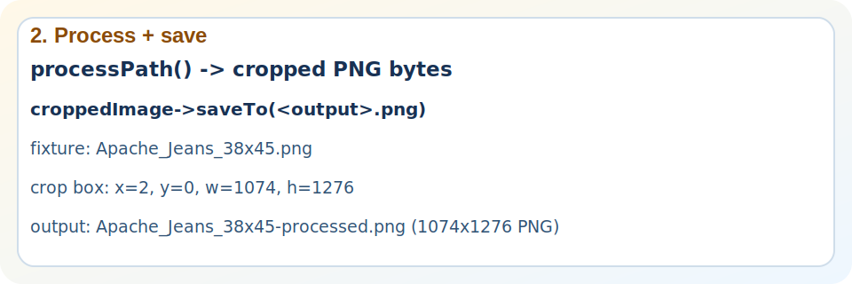</td>
    <td></td>
  </tr>
</table>

Crop note: `1077x1276` -> `1074x1276` PNG, saved from crop box `x=2, y=0, w=1074, h=1276`.

## Boutique Klamotte

<table>
  <tr>
    <th>1. Original image</th>
    <th>2. Process + save</th>
    <th>3. Final PNG output</th>
  </tr>
  <tr>
    <td>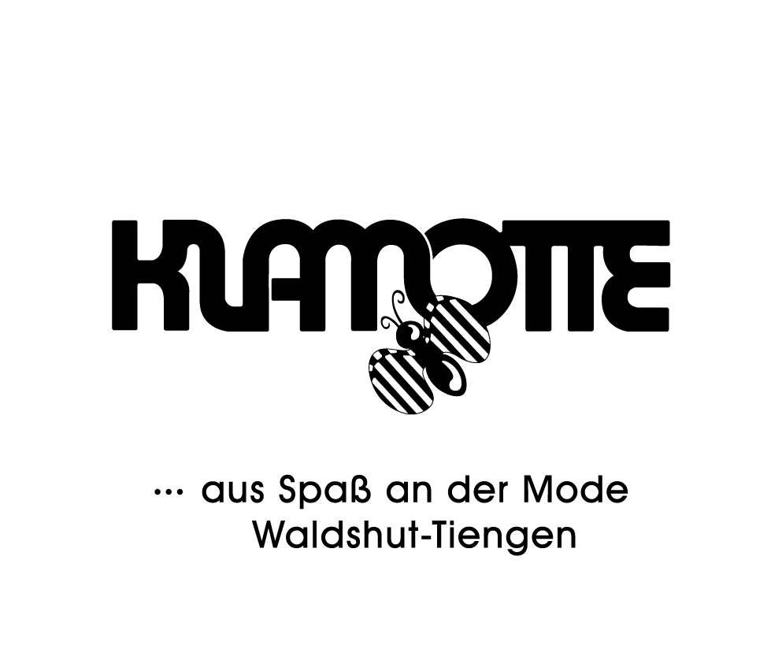</td>
    <td>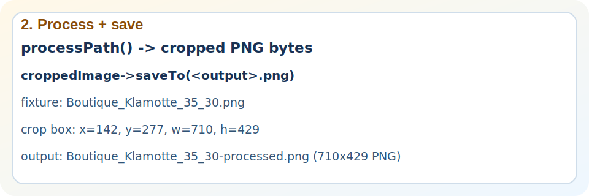</td>
    <td></td>
  </tr>
</table>

Crop note: `993x852` -> `710x429` PNG, saved from crop box `x=142, y=277, w=710, h=429`.

## Coffee Station

<table>
  <tr>
    <th>1. Original image</th>
    <th>2. Process + save</th>
    <th>3. Final PNG output</th>
  </tr>
  <tr>
    <td>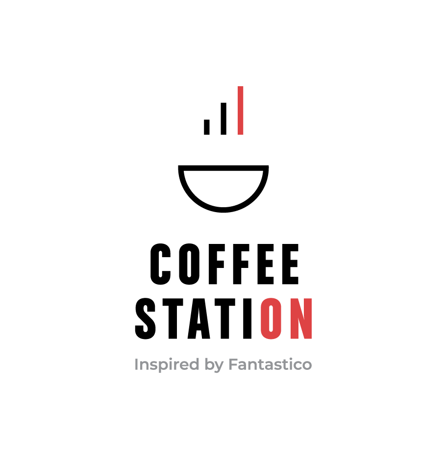</td>
    <td></td>
    <td>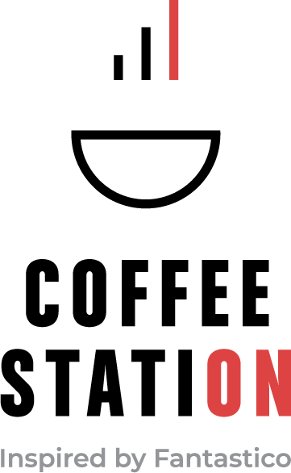</td>
  </tr>
</table>

Crop note: `908x937` -> `361x586` PNG, saved from crop box `x=275, y=176, w=361, h=586`.

## Decathlon

<table>
  <tr>
    <th>1. Original image</th>
    <th>2. Process + save</th>
    <th>3. Final PNG output</th>
  </tr>
  <tr>
    <td>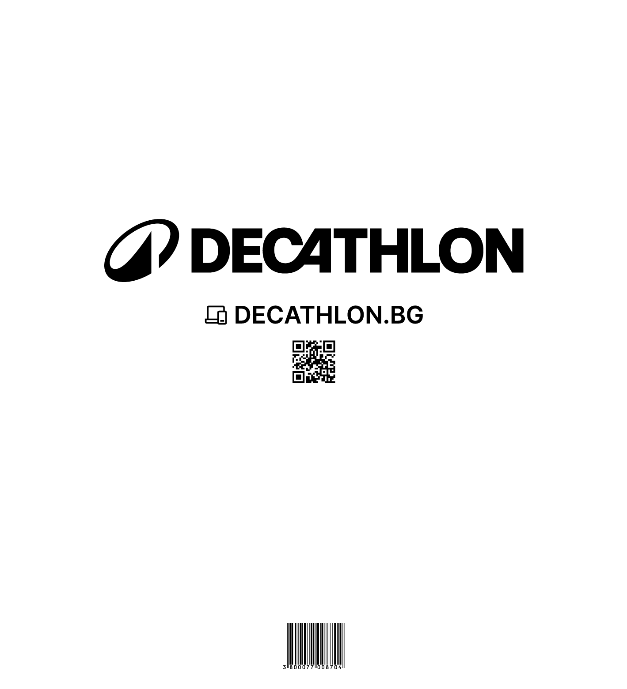</td>
    <td>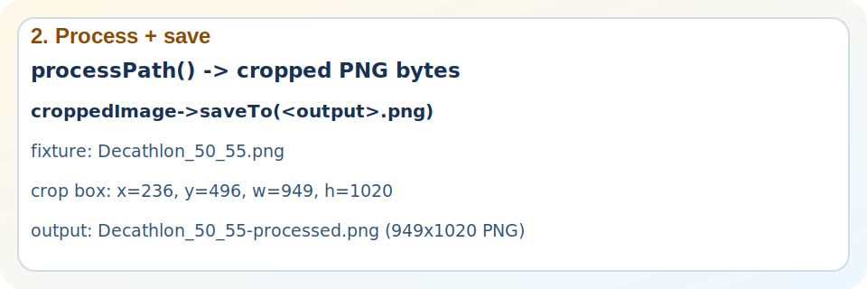</td>
    <td>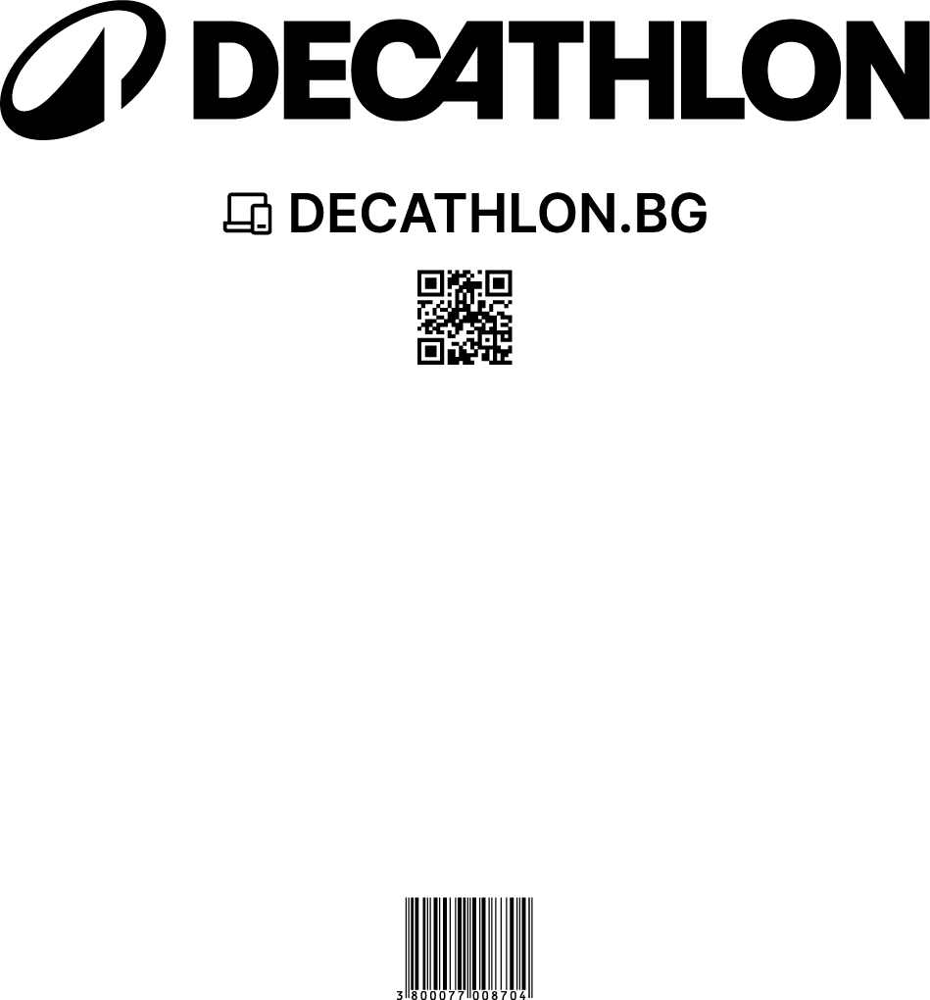</td>
  </tr>
</table>

Crop note: `1419x1561` -> `949x1020` PNG, saved from crop box `x=236, y=496, w=949, h=1020`.

## E-Wheels Europe

<table>
  <tr>
    <th>1. Original image</th>
    <th>2. Process + save</th>
    <th>3. Final PNG output</th>
  </tr>
  <tr>
    <td>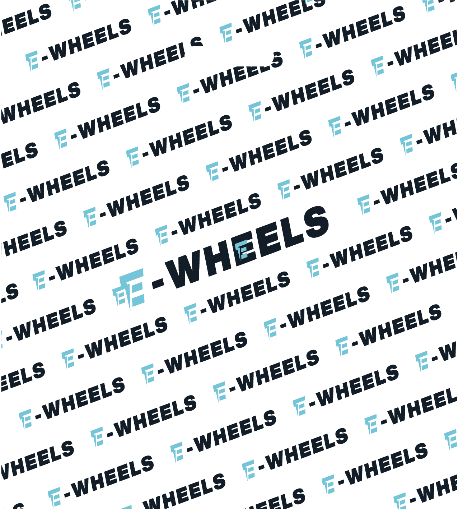</td>
    <td>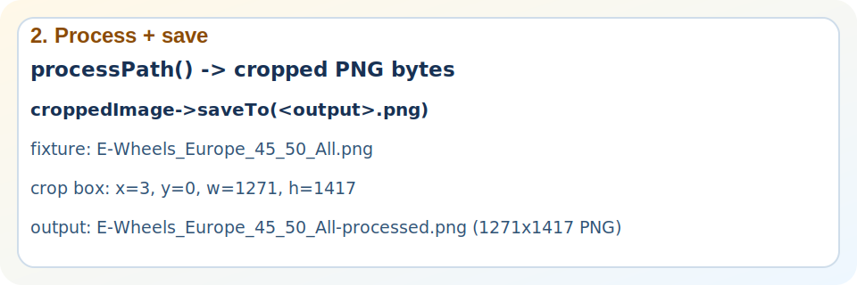</td>
    <td>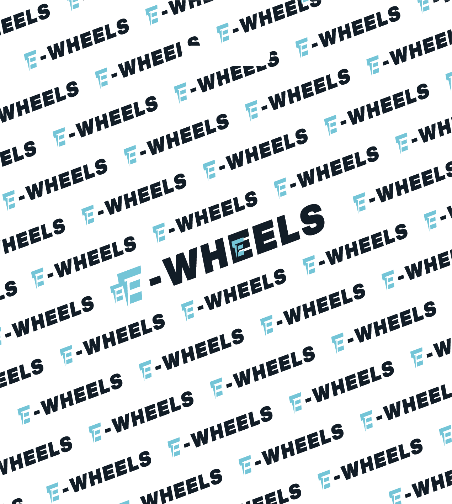</td>
  </tr>
</table>

Crop note: `1276x1417` -> `1271x1417` PNG, saved from crop box `x=3, y=0, w=1271, h=1417`.

## Star Be Restaurant Germany

<table>
  <tr>
    <th>1. Original image</th>
    <th>2. Process + save</th>
    <th>3. Final PNG output</th>
  </tr>
  <tr>
    <td>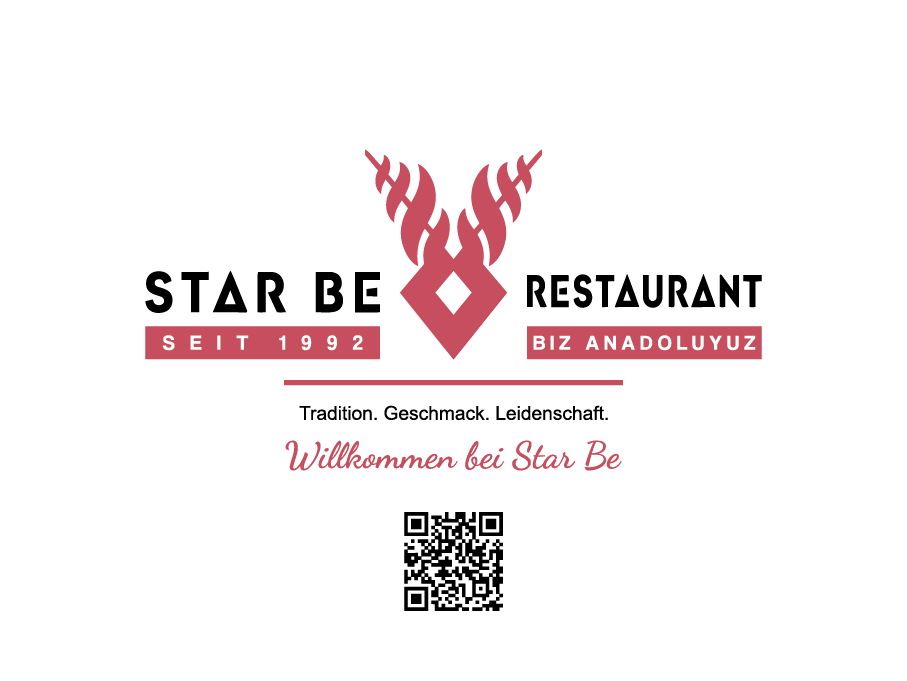</td>
    <td>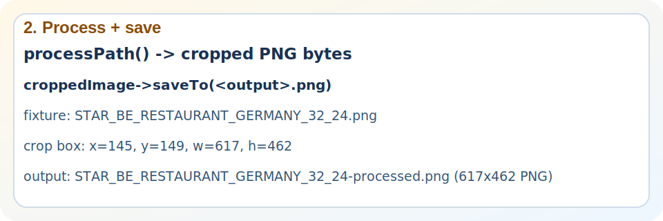</td>
    <td></td>
  </tr>
</table>

Crop note: `907x681` -> `617x462` PNG, saved from crop box `x=145, y=149, w=617, h=462`.

## Whole Foods

<table>
  <tr>
    <th>1. Original image</th>
    <th>2. Process + save</th>
    <th>3. Final PNG output</th>
  </tr>
  <tr>
    <td></td>
    <td></td>
    <td></td>
  </tr>
</table>

Crop note: `1077x1162` -> `664x523` PNG, saved from crop box `x=207, y=321, w=664, h=523`.
